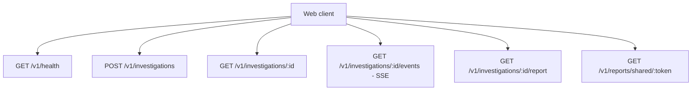

# API - Video Harness Space

Status: health, criacao, consulta, SSE e report de investigacao implementados.

Prefixo inicial: `/v1`.

## Diagrama



## Referencia rapida

| Status | Method | Path | Descricao |
|---|---|---|---|
| Implementado | GET | `/v1/health` | Saude da API e PostgreSQL |
| Implementado | POST | `/v1/investigations` | Criar investigacao e enfileirar pipeline |
| Implementado | GET | `/v1/investigations/:id` | Estado atual e metadados do caso |
| Implementado | GET | `/v1/investigations/:id/events` | Historico e stream SSE da timeline |
| Implementado | GET | `/v1/investigations/:id/report` | Report final do caso |
| Planejado | GET | `/v1/reports/shared/:token` | Report compartilhado por token |

## Criar investigacao

```http
POST /v1/investigations
Content-Type: application/json
Idempotency-Key: <client-generated-key>
```

```json
{
  "url": "https://example.test/live/master.m3u8",
  "problemDescription": "The stream freezes after 15 minutes on Samsung TVs."
}
```

Resposta: `202 Accepted`.

```json
{
  "investigation": {
    "id": "uuid",
    "sourceUrl": "https://example.test/live/master.m3u8",
    "state": "queued",
    "createdAt": "2026-07-21T12:00:00.000Z",
    "updatedAt": "2026-07-21T12:00:00.000Z"
  },
  "replayed": false
}
```

`Idempotency-Key` e obrigatorio. Repetir a mesma request retorna a mesma
investigacao com `replayed=true` e header `x-idempotency-replayed: true`. Reutilizar
a chave com outro payload retorna `409 IDEMPOTENCY_CONFLICT`.

## State machine inicial

```text
queued -> validating -> collecting -> analyzing -> synthesizing -> completed
   |          |             |            |              |
   +----------+-------------+------------+--------------+-> failed
```

## SSE

```http
GET /v1/investigations/:id/events
Accept: text/event-stream
Last-Event-ID: 42
```

Eventos previstos no contrato:

- `investigation.snapshot`;
- `investigation.state_changed`;
- `investigation.observation`;
- `investigation.evidence_found`;
- `investigation.hypothesis_updated`;
- `investigation.report_ready`;
- `investigation.failed`;
- `ping`.

Todo evento de produto e persistido antes de ser enviado. `ping` e transporte e
nao precisa ser persistido.

A conexao envia primeiro todos os eventos com `id > Last-Event-ID` e continua
consultando o PostgreSQL. Eventos de produto usam:

```text
id: 42
event: investigation.event
data: { ...InvestigationEvent }
```

O payload contem `id`, `investigationId`, `type`, `actor`, `message`, `payload` e
`createdAt`. A API envia `ping` a cada 15 segundos quando nao ha atividade.

## Consultar investigacao

```http
GET /v1/investigations/:id
```

Retorna `{ "investigation": Investigation }` ou `404 INVESTIGATION_NOT_FOUND`.

## Consultar report

```http
GET /v1/investigations/:id/report
```

Retorna `{ "report": InvestigationReport }`. Antes da conclusao retorna
`404 REPORT_NOT_READY`. Reports antigos da Fase 1 possuem
`placeholder=true`. A coleta de manifest da Fase 2 produz `placeholder=false`,
`generatedBy=deterministic-manifest-v2` e um `EvidenceBundle` v2 com source,
manifests, media samples, observations e limitations. Reports anteriores com
`generatedBy=deterministic-manifest-v1` e `EvidenceBundle` v1 continuam aceitos.
Para masters HLS, o bundle inclui `hls.variants`, `hls.renditions` e
`hls.selection`. `manifests` pode conter os logical keys `manifest/root`,
`manifest/variant/0` e `manifest/rendition/audio/0`. A selecao atual usa maior
bandwidth e no maximo uma rendition de audio vinculada. O report mais recente usa
`generatedBy=deterministic-media-v1`: alem dos manifests, `mediaSamples` pode
trazer init/media artifacts, sequencia, duracao declarada e o resultado
estruturado do FFprobe (container, tracks, codecs e timestamps). A amostra e
limitada e nao representa uma simulacao completa de playback.

Quando `VIDEO_HARNESS_AI_API_KEY` esta configurada, o mesmo report pode incluir
`content.ai`, com findings, recomendacoes e execucoes dos especialistas Pi. Todo
finding de IA referencia apenas IDs presentes na evidencia serializada; sem chave
o report deterministico continua sendo concluido com a limitacao correspondente.

Falhas de coleta podem encerrar a investigation com codigos como:

- `STREAM_DESTINATION_BLOCKED`;
- `STREAM_REQUEST_TIMEOUT`;
- `STREAM_RESPONSE_TOO_LARGE`;
- `STREAM_TOO_MANY_REDIRECTS`;
- `STREAM_HTTP_ERROR`;
- `UNSUPPORTED_MANIFEST`.

O runtime padrao bloqueia localhost e redes privadas. Somente o Docker Compose
local configura o hostname exato `localhost` como alias para o host de
desenvolvimento; IPs privados literais e redirects para outros destinos privados
continuam bloqueados. URLs publicas tambem nao podem redirecionar para o alias
localhost.

## Erros

Formato planejado:

```json
{
  "ok": false,
  "error": {
    "code": "INVALID_STREAM_URL",
    "message": "The provided URL could not be investigated.",
    "requestId": "request-id"
  }
}
```

Mensagens publicas nao devem expor paths, tokens, comandos ou detalhes internos de
rede.

## Health

```http
GET /v1/health
```

Retorna `200` quando PostgreSQL esta acessivel e `503` quando o banco esta
indisponivel.

```json
{
  "ok": true,
  "service": "video-harness-api",
  "version": "0.1.0",
  "now": "2026-07-21T12:00:00.000Z",
  "uptimeSeconds": 12,
  "database": {
    "status": "up"
  }
}
```
