# API - Video Harness Space

Status: Investigate, validacao opcional de playback, clone HLS VOD e data plane
sem shaping de Record estao implementados. Shaping e journal ABR pertencem aos
slices seguintes de Record R1.

Prefixo do control plane: `/v1`. O data plane consumido pelo device usa
`/streams/:playbackToken/*`.

## Diagrama

```mermaid
flowchart TD
    Client[Web client] --> Health[GET /v1/health]
    Client --> Create[POST /v1/investigations]
    Client --> Detail[GET /v1/investigations/:id]
    Client --> Events[GET /v1/investigations/:id/events - SSE]
    Client --> Report[GET /v1/investigations/:id/report]
    Client --> Artifacts[GET /v1/investigations/:id/artifacts]
    Client --> Artifact[GET /v1/investigations/:id/artifacts/:artifactId]
    Client --> Playback[POST /v1/investigations/:id/playback-sessions]
    Playback --> Review[worker playback_synthesis]
    Review --> Report
    Client --> Share[GET /v1/reports/shared/:token]
    Client --> CreateRecording[POST /v1/recordings]
    CreateRecording --> RecordingWorker[worker recording job]
    RecordingWorker --> RecordingStore[(recording storage)]
    Client --> Recording[GET /v1/recordings/:id]
    Client --> RecordingEvents[GET /v1/recordings/:id/events - SSE]
    Client --> CreateRun[POST /v1/recordings/:id/playback-runs]
    Client --> Run[GET /v1/recordings/:id/playback-runs/:runId]
    Client --> Requests[GET /v1/recordings/:id/playback-runs/:runId/requests]
    Device[Device/player] --> DataPlane[GET /streams/:playbackToken/*]
    DataPlane --> RecordingStore
    DataPlane --> Requests
```



## Referencia rapida

| Status | Method | Path | Descricao |
|---|---|---|---|
| Implementado | GET | `/v1/health` | Saude da API e PostgreSQL |
| Implementado | POST | `/v1/investigations` | Criar investigacao e enfileirar pipeline |
| Implementado | GET | `/v1/investigations/:id` | Estado atual e metadados do caso |
| Implementado | GET | `/v1/investigations/:id/events` | Historico e stream SSE da timeline |
| Implementado | GET | `/v1/investigations/:id/report` | Report final do caso |
| Implementado | GET | `/v1/investigations/:id/artifacts` | Lista artifacts preservados do caso |
| Implementado | GET | `/v1/investigations/:id/artifacts/:artifactId` | Baixa um artifact preservado |
| Implementado | POST | `/v1/investigations/:id/playback-sessions` | Iniciar validacao explicita no navegador |
| Implementado | GET | `/v1/investigations/:id/playback-sessions/latest` | Ultima validacao do caso |
| Implementado | POST | `/v1/investigations/:id/playback-sessions/:sessionId/complete` | Persistir telemetria e enfileirar revisao |
| Implementado | POST | `/v1/investigations/:id/playback-sessions/:sessionId/fail` | Encerrar tentativa sem mudar o report |
| Planejado | GET | `/v1/reports/shared/:token` | Report compartilhado por token |
| Implementado R1 | POST | `/v1/recordings` | Criar recording HLS VOD e enfileirar coleta |
| Implementado R1 | GET | `/v1/recordings/:id` | Estado, cobertura e falha publica |
| Implementado R1 | GET | `/v1/recordings/:id/events` | Historico e SSE do recording |
| Implementado R1 | POST | `/v1/recordings/:id/playback-runs` | Criar experimento e URL opaca |
| Planejado R1 | GET | `/v1/recordings/:id/playback-runs/:runId` | Estado e resumo ABR do run |
| Implementado R1 | GET | `/v1/recordings/:id/playback-runs/:runId/requests` | Ultimos delivery requests do run |
| Planejado R1 | POST | `/v1/recordings/:id/playback-runs/:runId/finish` | Encerrar run e congelar resumo |
| Implementado R1 | GET | `/streams/:playbackToken/*` | Data plane local sem shaping |

## Criar investigacao

```http
POST /v1/investigations
Content-Type: application/json
Idempotency-Key: <client-generated-key>
```

```json
{
  "url": "https://example.test/live/master.m3u8",
  "problemDescription": "The stream freezes after 15 minutes on Samsung TVs."
}
```

Resposta: `202 Accepted`.

```json
{
  "investigation": {
    "id": "uuid",
    "sourceUrl": "https://example.test/live/master.m3u8",
    "state": "queued",
    "createdAt": "2026-07-21T12:00:00.000Z",
    "updatedAt": "2026-07-21T12:00:00.000Z"
  },
  "replayed": false
}
```

`Idempotency-Key` e obrigatorio. Repetir a mesma request retorna a mesma
investigacao com `replayed=true` e header `x-idempotency-replayed: true`. Reutilizar
a chave com outro payload retorna `409 IDEMPOTENCY_CONFLICT`.

## State machine inicial

```text
queued -> validating -> collecting -> analyzing -> synthesizing -> completed
   |          |             |            |              |
   +----------+-------------+------------+--------------+-> failed
```

## SSE

```http
GET /v1/investigations/:id/events
Accept: text/event-stream
Last-Event-ID: 42
```

Eventos previstos no contrato:

- `investigation.snapshot`;
- `investigation.state_changed`;
- `investigation.observation`;
- `investigation.evidence_found`;
- `investigation.hypothesis_updated`;
- `investigation.report_ready`;
- `investigation.failed`;
- `ping`.

Todo evento de produto e persistido antes de ser enviado. `ping` e transporte e
nao precisa ser persistido.

A conexao envia primeiro todos os eventos com `id > Last-Event-ID` e continua
consultando o PostgreSQL. Eventos de produto usam:

```text
id: 42
event: investigation.event
data: { ...InvestigationEvent }
```

O payload contem `id`, `investigationId`, `type`, `actor`, `message`, `payload` e
`createdAt`. A API envia `ping` a cada 15 segundos quando nao ha atividade.
`investigation.playback_completed` informa a revisao pendente e
`investigation.report_updated` informa que ela terminou; o caso permanece
`completed` durante esse processo.

### Progresso da analise de IA

Enquanto o caso esta em `analyzing`, o worker publica uma observacao por etapa
real de cada agente de IA. O `actor` e o identificador do agente
(`timeline-playback`, `container-encoding`, `manifest-delivery` ou
`lead-investigator`) e o payload tem a forma:

```json
{
  "state": "analyzing",
  "stage": "ai_agent",
  "agent": "timeline-playback",
  "agentStage": "started",
  "completed": 0,
  "total": 4
}
```

`agentStage` pode ser `started`, `completed` ou `failed`. `completed` e `total`
contam o conjunto conhecido e limitado de runs (tres especialistas mais o Lead);
nao sao estimativa. Em `failed`, a `message` carrega a limitacao publica da
falha, sem conteudo de prompt ou raciocinio.

## Consultar investigacao

```http
GET /v1/investigations/:id
```

Retorna `{ "investigation": Investigation }` ou `404 INVESTIGATION_NOT_FOUND`.

## Consultar report

```http
GET /v1/investigations/:id/report
```

Retorna `{ "report": InvestigationReport }`. Antes da conclusao retorna
`404 REPORT_NOT_READY`. Reports antigos da Fase 1 possuem
`placeholder=true`. A coleta de manifest da Fase 2 produz `placeholder=false`,
`generatedBy=deterministic-manifest-v2` e um `EvidenceBundle` v2 com source,
manifests, media samples, observations e limitations. Reports anteriores com
`generatedBy=deterministic-manifest-v1` e `EvidenceBundle` v1 continuam aceitos.
Para masters HLS, o bundle inclui `hls.variants`, `hls.renditions` e
`hls.selection`. `manifests` pode conter os logical keys `manifest/root`,
`manifest/variant/0` e `manifest/rendition/audio/0`. A selecao atual usa maior
bandwidth e no maximo uma rendition de audio vinculada. O report mais recente usa
`generatedBy=deterministic-media-v1`: alem dos manifests, `mediaSamples` pode
trazer init/media artifacts, sequencia, duracao declarada e o resultado
estruturado do FFprobe (container, tracks, codecs e timestamps). O modo default
`full` baixa todos os segmentos ate o budget agregado; em VOD curto todo o conteudo
e materializado, ja em streams longas o budget cobre apenas o inicio. O modo
`sample` baixa somente inicio/meio/fim. A coleta e limitada e nao representa uma
simulacao completa de playback.

Quando `VIDEO_HARNESS_AI_API_KEY` esta configurada, o mesmo report pode incluir
`content.ai`, com findings, recomendacoes e execucoes dos especialistas Pi. Todo
finding de IA referencia apenas IDs presentes na evidencia serializada; sem chave
o report deterministico continua sendo concluido com a limitacao correspondente.

### Perfil forense DASH

Para MPDs DASH estaticos suportados, o `EvidenceBundle` v2 pode incluir
`reportedContext` e `dash`. O primeiro representa somente pistas explicitamente
relatadas pelo usuario; `dash` traz representations expandidas, hashes de media,
inspecao fMP4/HEVC e a matriz estrutural de fronteiras candidatas. Sem logs de
player, a API nao confirma que uma troca ocorreu: o report identifica apenas a
fronteira temporal mais relevante para o relato.

## Artifacts

`GET /v1/investigations/:id/artifacts` retorna a lista de artifacts preservados
sem expor `storageKey`. `GET /v1/investigations/:id/artifacts/:artifactId` devolve
o byte original como attachment. Esses endpoints sao para o workspace do caso;
links compartilhados devem usar uma camada de redacao/autorizacao futura.

## Validacao de playback no navegador

Disponivel apenas apos o primeiro report e iniciada por acao explicita.
`POST /v1/investigations/:id/playback-sessions` aceita opcionalmente
`{ "requestedDurationMs": 30000 }` (5 a 60 segundos) e devolve a sessao e a URL
original. O browser toca a origem diretamente com hls.js (ou HLS nativo) e envia
tempos, stalls, fragmentos, qualidade, frames descartados, erros HLS limitados e
limitations para `/complete`.

Nao sao enviados comandos, URLs derivadas, headers, bytes de midia ou logs do
console. A origem precisa habilitar CORS para a pagina. A telemetria vira artifact
e um job `playback_synthesis` revisa o report sem bloquear ou substituir o report
inicial em caso de falha.

Falhas de coleta podem encerrar a investigation com codigos como:

- `STREAM_DESTINATION_BLOCKED`;
- `STREAM_REQUEST_TIMEOUT`;
- `STREAM_RESPONSE_TOO_LARGE`;
- `STREAM_TOO_MANY_REDIRECTS`;
- `STREAM_HTTP_ERROR`;
- `UNSUPPORTED_MANIFEST`.

O runtime padrao bloqueia localhost e redes privadas. Somente o Docker Compose
local configura o hostname exato `localhost` como alias para o host de
desenvolvimento; IPs privados literais e redirects para outros destinos privados
continuam bloqueados. URLs publicas tambem nao podem redirecionar para o alias
localhost.

## Record HLS VOD - contratos R1

O Slice 2 habilita as rotas de `recordings` na composicao de producao. O worker
aceita somente master HLS VOD clear/MPEG-TS, com 2--8 variants fetchable e
renditions de audio vinculadas. Live, criptografia, fMP4/`EXT-X-MAP` e byte ranges
falham de forma explicita antes da publicacao. O primeiro playback run e data
plane GET estao implementados; profile de rede, journal, `HEAD`, `OPTIONS`, Range
e encerramento de run seguem planejados.

### Criar recording

```http
POST /v1/recordings
Content-Type: application/json
Idempotency-Key: <client-generated-key>
```

```json
{
  "url": "https://example.test/vod/master.m3u8",
  "durationSeconds": 120,
  "startSeconds": 0
}
```

Regras iniciais:

- `url` aceita somente HTTP(S), sem credenciais embutidas;
- `durationSeconds` fica entre 30 e 600, default 120;
- `startSeconds` fica entre 0 e 86.400, default 0;
- o backend sempre tenta materializar toda a ladder suportada;
- `Idempotency-Key` e obrigatorio e segue a semantica de Investigate.

Resposta: `202 Accepted`.

```json
{
  "recording": {
    "id": "uuid",
    "sourceUrl": "https://example.test/vod/master.m3u8",
    "protocol": "hls",
    "state": "queued",
    "requestedDurationSeconds": 120,
    "requestedStartSeconds": 0,
    "createdAt": "2026-08-05T12:00:00.000Z",
    "updatedAt": "2026-08-05T12:00:00.000Z"
  },
  "replayed": false
}
```

State machine:

```text
queued -> validating -> collecting -> ready
   |          |             |
   +----------+-------------+-> failed
```

`ready` significa que manifests, recursos e metadata foram publicados
atomicamente. Um workspace parcial nunca recebe playback URL.

### Consultar recording

```http
GET /v1/recordings/:id
```

Quando pronto, o contrato final incluira:

- cobertura solicitada e efetiva;
- bytes e quantidade de recursos;
- variants com ID, bandwidth, resolucao e codecs;
- renditions gravadas;
- `abrEligible`, verdadeiro somente quando existem pelo menos duas variants de
  video tocaveis;
- limitations e falha publica opcional.

Storage keys, paths locais e URLs derivadas da origem nao sao expostos.

### Eventos do recording

```http
GET /v1/recordings/:id/events
Accept: text/event-stream
Last-Event-ID: 42
```

Usa o mesmo formato de transporte SSE de investigations, com evento
`recording.event`. O transporte ja esta implementado; os tipos que o coletor HLS
adicionara sao:

- `recording.created`;
- `recording.state_changed`;
- `recording.manifest_validated`;
- `recording.ladder_discovered`;
- `recording.variant_started`;
- `recording.variant_completed`;
- `recording.published`;
- `recording.failed`.

Contagens publicadas representam trabalho real. Nao existe percentual estimado.

### Criar playback run

Disponivel somente quando o recording esta `ready`.

```http
POST /v1/recordings/:id/playback-runs
Content-Type: application/json
```

```json
{
  "profile": {
    "schemaVersion": 1,
    "name": "downshift-and-recovery",
    "stages": [
      { "afterVideoRequests": 0, "bandwidthKbps": 12000, "latencyMs": 30 },
      { "afterVideoRequests": 3, "bandwidthKbps": 1200, "latencyMs": 200 },
      { "afterVideoRequests": 8, "bandwidthKbps": 12000, "latencyMs": 30 }
    ]
  },
  "maxDurationSeconds": 300
}
```

Validacao de profile v1:

- entre 2 e 8 stages;
- primeiro `afterVideoRequests` igual a zero;
- triggers inteiros, unicos e estritamente crescentes;
- `bandwidthKbps` entre 128 e 100.000;
- `latencyMs` entre 0 e 5.000;
- `maxDurationSeconds` entre 30 e 900, default 300.

Resposta: `201 Created`.

```json
{
  "run": {
    "id": "uuid",
    "recordingId": "uuid",
    "state": "created",
    "profile": {
      "schemaVersion": 1,
      "name": "downshift-and-recovery",
      "stages": []
    },
    "createdAt": "2026-08-05T12:05:00.000Z",
    "expiresAt": "2026-08-05T12:20:00.000Z"
  },
  "playbackUrl": "https://vhs.example/streams/<opaque-token>/index.m3u8"
}
```

O array `stages` aparece completo na resposta real; foi abreviado apenas neste
exemplo. O token e retornado no playback URL, armazenado somente como hash e
redigido dos logs da aplicacao.

O clock do profile comeca no primeiro request de video, quando o run transiciona
de `created` para `active`. Enquanto isso, a URL possui uma janela limitada de
inicializacao. Manifests recebem a latencia do stage, mas nao consomem o bucket;
video e audio sao emitidos progressivamente em blocos de 16 KiB sob o mesmo
bucket por run. O contador de stages e efemero no processo nesta etapa; o journal
persistido no Slice 5 passara a ser a fonte de verdade apos reinicio.

### Consultar e finalizar playback run

```http
GET /v1/recordings/:id/playback-runs/:runId
POST /v1/recordings/:id/playback-runs/:runId/finish
```

State machine:

```text
created -> active -> completed
   |          |
   +----------+-> expired
   +----------+-> failed
```

O GET inclui contagens de requests, stage atual, bytes entregues e o resumo:

```json
{
  "abrResult": {
    "status": "observed",
    "requestLevelOnly": true,
    "transitions": [
      {
        "direction": "downshift",
        "confidence": "sustained",
        "fromVariantId": "video-0",
        "toVariantId": "video-2",
        "atMediaSequence": 104,
        "atMs": 18420,
        "networkStageIndex": 1
      }
    ],
    "limitations": [
      "Requests prove representation selection, not decode or rendered frames."
    ]
  }
}
```

`status` pode ser `observed`, `not_observed` ou `inconclusive`. `confidence` de
uma transicao pode ser `observed` ou `sustained`.

`finish` impede novos downloads depois de um curto grace period, marca o run como
`completed` e congela o resumo. Runs vencidos retornam `410 PLAYBACK_RUN_EXPIRED`
no data plane.

### Journal de requests

```http
GET /v1/recordings/:id/playback-runs/:runId/requests?after=42&limit=100
```

O primeiro corte retorna os ultimos requests em ordem decrescente, com `limit`
entre 1 e 100 (default 10). Cursor e paginacao completa entram junto da
inferencia ABR. Cada item inclui:

- resource kind;
- variant/rendition ID;
- bandwidth e resolucao;
- media sequence;
- stage aplicado;
- latency/throughput configurados;
- inicio, fim, bytes, status e cancelamento;
- method e range limitado.

Tokens, query strings, headers sensiveis, IP completo e storage paths nunca sao
retornados.

### Data plane para devices

```http
GET /streams/:playbackToken/index.m3u8
GET /streams/:playbackToken/variants/:variantId/index.m3u8
GET /streams/:playbackToken/variants/:variantId/segments/:sequence.ts
```

Tambem aceita `HEAD` e `OPTIONS`; recursos de media suportam um unico `Range`
valido quando o container/player exigir. Paths sao resolvidos exclusivamente por
metadata persistida de `RecordedResource`.

Regras:

- nunca buscar a origem durante playback;
- `Cache-Control: no-store` e CORS explicito;
- manifests recebem a latencia do stage, mas nao consomem throughput de media;
- media concorrente compartilha um token bucket por run;
- bytes respeitam backpressure e desconexao;
- content type vem do recurso registrado;
- paths desconhecidos retornam 404 sem tocar o filesystem fora do recording;
- token invalido retorna 404 para evitar enumeracao;
- run expirado/finalizado retorna 410 para recursos novos.

O deploy deve rotear `/streams/*` sem buffering ou compressao que altere o paced
delivery. No Compose local, o Nginx da porta web encaminha explicitamente
`/streams/*` para a API; sem essa regra, o fallback SPA devolveria `index.html`
e players como VLC nao conseguiriam interpretar o manifesto.

## Erros

Formato planejado:

```json
{
  "ok": false,
  "error": {
    "code": "INVALID_STREAM_URL",
    "message": "The provided URL could not be investigated.",
    "requestId": "request-id"
  }
}
```

Mensagens publicas nao devem expor paths, tokens, comandos ou detalhes internos de
rede.

## Health

```http
GET /v1/health
```

Retorna `200` quando PostgreSQL esta acessivel e `503` quando o banco esta
indisponivel.

```json
{
  "ok": true,
  "service": "video-harness-api",
  "version": "0.1.0",
  "now": "2026-07-21T12:00:00.000Z",
  "uptimeSeconds": 12,
  "database": {
    "status": "up"
  }
}
```
