# API - Video Harness Space

Status: Investigate, experiments controlados, clone HLS VOD e DASH VOD estatico
e data plane de Record estao implementados. Investigate produz transicoes ABR candidatas a partir da
URL; Record correlaciona transicoes efetivamente observadas no journal. Evidencia
de player/device permanece opcional e nunca e inferida quando ausente. Toda
investigation nova inclui um `AbrAssessment` HLS ou DASH.

Prefixo do control plane: `/v1`. O data plane consumido pelo device usa
`/streams/recordings/:recordingId/*` e `/streams/experiments/:experimentId/*`.
A URL e fixa por recording ou experiment: iniciar ou
encerrar um playback run nunca muda a URL que o device ja tem. Cada request
resolve o run aberto atual para aplicar o perfil de rede e atribuir o journal;
sem run ativo, o clone e servido com o perfil baseline.

## Diagrama

```mermaid
flowchart TD
    Client[Web client] --> Health[GET /v1/health]
    Client --> Create[POST /v1/investigations]
    Client --> List[GET /v1/investigations]
    Client --> Delete[DELETE /v1/investigations/:id]
    Client --> Detail[GET /v1/investigations/:id]
    Client --> Events[GET /v1/investigations/:id/events - SSE]
    Client --> Report[GET /v1/investigations/:id/report]
    Client --> Evidence[GET /v1/investigations/:id/evidence]
    Client --> Analysis[POST /v1/investigations/:id/analysis]
    Client --> Question[POST /v1/investigations/:id/questions]
    Evidence --> Analysis
    Analysis --> AnalysisJob[worker investigation-analysis job]
    AnalysisJob --> AiRuns
    AnalysisJob --> Report
    Report --> AbrAssessment[EvidenceBundle.abr]
    Client --> AiRuns[GET /v1/investigations/:id/ai-runs]
    Client --> Artifacts[GET /v1/investigations/:id/artifacts]
    Client --> Artifact[GET /v1/investigations/:id/artifacts/:artifactId]
    Client --> Playback[POST /v1/investigations/:id/playback-sessions]
    Playback --> Review[worker playback_synthesis]
    Review --> Report
    Client --> Share[GET /v1/reports/shared/:token]
    Client --> CreateRecording[POST /v1/recordings]
    CreateRecording --> RecordingWorker[worker recording job]
    RecordingWorker --> RecordingStore[(recording storage)]
    Client --> Recording[GET /v1/recordings/:id]
    Client --> RecordingEvents[GET /v1/recordings/:id/events - SSE]
    Client --> CreateRun[POST /v1/recordings/:id/playback-runs]
    Client --> LatestRun[GET /v1/recordings/:id/playback-runs/latest]
    Client --> FinishRun[POST /v1/recordings/:id/playback-runs/:runId/finish]
    Client --> Run[GET /v1/recordings/:id/playback-runs/:runId]
    Client --> Requests[GET /v1/recordings/:id/playback-runs/:runId/requests]
    Client --> AbrSwitches[GET /v1/recordings/:id/playback-runs/:runId/abr-switches]
    Client --> Experiment[POST/GET /v1/investigations/:id/experiments]
    Experiment --> Iteration[POST /v1/experiments/:id/iterations]
    Iteration --> CloneJobs[POST /v1/experiments/:id/clones]
    CloneJobs --> RecordingWorker
    Client --> SelectTreatment[POST /v1/test-requests/:id/activate]
    Client --> TestResult[POST /v1/test-requests/:id/results]
    Client --> Evaluate[POST /v1/experiments/:id/evaluate]
    Evaluate --> EvaluationJob[worker experiment-evaluation job]
    EvaluationJob --> EvidenceAuditor[Evidence Auditor]
    EvidenceAuditor --> CausalAnalyst[Causal Analyst]
    CausalAnalyst --> ExperimentLead[Lead Experiment Investigator]
    ExperimentLead --> Evaluation[(structured evaluation)]
    SelectTreatment --> ExperimentDataPlane[GET/HEAD/OPTIONS /streams/experiments/:experimentId/*]
    Device --> ExperimentDataPlane
    ExperimentDataPlane --> RecordingStore
    Device[Browser/device player] --> DataPlane[GET/HEAD/OPTIONS /streams/recordings/:recordingId/*]
    DataPlane --> RecordingStore
    DataPlane --> Requests
    Requests --> AbrSwitches
```



## Referencia rapida

| Status | Method | Path | Descricao |
|---|---|---|---|
| Implementado | GET | `/v1/health` | Saude da API e PostgreSQL |
| Implementado | POST | `/v1/investigations` | Criar investigacao e enfileirar somente a coleta deterministica |
| Implementado | GET | `/v1/investigations` | Listar investigations (mais recentes primeiro) para o workspace |
| Implementado | DELETE | `/v1/investigations/:id` | Apagar investigation e todos os seus dados: jobs, eventos, artifacts (arquivos), reports, snapshots, agent runs, playback sessions, shell runs, experiments e recordings vinculadas (arquivos e workspaces) |
| Implementado | GET | `/v1/investigations/:id` | Estado atual e metadados do caso |
| Implementado | GET | `/v1/investigations/:id/events` | Historico e stream SSE da timeline |
| Implementado | GET | `/v1/investigations/:id/report` | Report final, incluindo baseline `AbrAssessment` em coletas novas |
| Implementado | GET | `/v1/investigations/:id/evidence` | Ultimo snapshot imutavel de evidencia deterministica, disponivel antes do report |
| Implementado | POST | `/v1/investigations/:id/analysis` | Enfileirar a analise dos agentes somente depois de `evidence_ready` |
| Implementado | POST | `/v1/investigations/:id/questions` | Persistir uma pergunta do usuario na timeline do caso; nao aciona IA implicitamente |
| Implementado | GET | `/v1/investigations/:id/ai-runs` | Runs persistidos com snapshot, prompt, ferramentas e output validado |
| Implementado | GET | `/v1/investigations/:id/artifacts` | Lista artifacts preservados do caso |
| Implementado | GET | `/v1/investigations/:id/artifacts/:artifactId` | Baixa um artifact preservado |
| Implementado | POST | `/v1/investigations/:id/playback-sessions` | Iniciar validacao explicita no navegador |
| Implementado | GET | `/v1/investigations/:id/playback-sessions/latest` | Ultima validacao do caso |
| Implementado | POST | `/v1/investigations/:id/playback-sessions/:sessionId/complete` | Persistir telemetria e enfileirar revisao |
| Implementado | POST | `/v1/investigations/:id/playback-sessions/:sessionId/fail` | Encerrar tentativa sem mudar o report |
| Planejado | GET | `/v1/reports/shared/:token` | Report compartilhado por token |
| Implementado R1/R2 | POST | `/v1/recordings` | Criar recording HLS ou DASH VOD e enfileirar coleta |
| Implementado R1 | GET | `/v1/recordings/:id` | Estado, cobertura e falha publica |
| Implementado R1 | GET | `/v1/recordings/:id/events` | Historico e SSE do recording |
| Implementado R1 | POST | `/v1/recordings/:id/playback-runs` | Criar experimento; devolve a URL fixa do recording |
| Implementado R1 | GET | `/v1/recordings/:id/playback-runs/latest` | Último run aberto, para restaurar a tela após refresh |
| Planejado R1 | GET | `/v1/recordings/:id/playback-runs/:runId` | Estado e resumo ABR do run |
| Implementado R1 | GET | `/v1/recordings/:id/playback-runs/:runId/requests` | Ultimos delivery requests do run |
| Implementado R2 | GET | `/v1/recordings/:id/playback-runs/:runId/abr-switches` | `AbrSwitchEvidence` por transicao observada no journal |
| Implementado R1 | POST | `/v1/recordings/:id/playback-runs/:runId/finish` | Encerrar run e congelar o resumo |
| Implementado R1/R2 | GET | `/streams/recordings/:recordingId/*` | URL fixa por recording; serve recursos publicados com shaping do run ativo |
| Implementado R1/R2 | HEAD | `/streams/recordings/:recordingId/*` | Consulta headers, tamanho e Range sem shaping ou journal |
| Implementado R1/R2 | OPTIONS | `/streams/recordings/:recordingId/*` | Preflight CORS para GET/HEAD e header `Range` |
| Implementado | POST | `/v1/investigations/:id/experiments` | Criar Experiment e hipoteses estruturadas |
| Implementado | GET | `/v1/investigations/:id/experiments` | Listar experiments do caso |
| Implementado | GET | `/v1/experiments/:id` | Agregado com hipoteses, iteracoes, clones, requests e avaliacoes |
| Implementado | POST | `/v1/experiments/:id/iterations` | Persistir um plano pequeno de CloneSpecs |
| Implementado | GET | `/v1/experiments/:id/iterations/:iterationId` | Consultar uma iteracao e seus clones/tests |
| Implementado | POST | `/v1/experiments/:id/clones` | Enfileirar clones no worker Record existente |
| Implementado | GET | `/v1/clones/:id` | Estado, plano, verificacao e provenance do clone |
| Implementado | GET | `/v1/experiments/:id/test-requests` | Listar testes humanos/device |
| Implementado | POST | `/v1/test-requests/:id/activate` | Selecionar o tratamento entregue pela URL fixa do experiment |
| Implementado | POST | `/v1/test-requests/:id/results` | Registrar resultado atribuido e estruturado |
| Implementado | POST | `/v1/experiments/:id/evaluate` | Enfileirar avaliacao recuperavel por tres agentes; `202` idempotente enquanto ativa |
| Implementado | GET/POST | `/v1/test-environments` | Listar ou salvar environments reutilizaveis |
| Implementado | GET | `/v1/clone-capabilities` | Operacoes realmente suportadas e limites atuais |
| Implementado | POST | `/v1/clone-specs/validate` | Validacao tipada sem executar media |
| Implementado | POST | `/v1/clone-specs/preview` | CloneSpec/recipe para plano declarativo sem executar |
| Implementado | GET/HEAD/OPTIONS | `/streams/experiments/:experimentId/*` | URL unica; resolve o TestRequest selecionado para recursos publicados |

## Criar investigacao

```http
POST /v1/investigations
Content-Type: application/json
Idempotency-Key: <client-generated-key>
```

```json
{
  "url": "https://example.test/live/master.m3u8",
  "problemDescription": "Quality oscillates on a stable connection and the video freezes during a downshift. Player logs can be pasted here when available."
}
```

Resposta: `202 Accepted`.

```json
{
  "investigation": {
    "id": "uuid",
    "sourceUrl": "https://example.test/live/master.m3u8",
    "state": "queued",
    "createdAt": "2026-07-21T12:00:00.000Z",
    "updatedAt": "2026-07-21T12:00:00.000Z"
  },
  "replayed": false
}
```

`Idempotency-Key` e obrigatorio. Repetir a mesma request retorna a mesma
investigacao com `replayed=true` e header `x-idempotency-replayed: true`. Reutilizar
a chave com outro payload retorna `409 IDEMPOTENCY_CONFLICT`.

## Adicionar pergunta ao caso

```http
POST /v1/investigations/:id/questions
Content-Type: application/json
```

```json
{ "question": "Compare o GOP em torno da transicao de qualidade." }
```

Resposta: `201 Created` com `{ "ok": true }`.

A pergunta vira `investigation.question_asked` no mesmo journal SSE do caso. Ela
nao dispara uma chamada de IA nem cria progresso ficticio; o proximo AgentRun
persistido devera referenciá-la explicitamente.

Somente `url` e obrigatoria. `problemDescription` aceita ate 20.000 caracteres e
pode conter sintomas, modelo/firmware e trechos de log de qualquer player. Esse
texto e persistido como contexto relatado: nomes de eventos encontrados nele nao
viram callbacks observados nem capability evidence.

## Iniciar analise dos agentes

```http
POST /v1/investigations/:id/analysis
```

Sem body, o endpoint aceita a transicao quando a coleta chegou a
`evidence_ready`, cria um job `investigation-analysis` e muda o caso para
`analysis_queued`. Resposta de uma nova solicitacao: `202 Accepted`.

```json
{ "accepted": true, "started": true }
```

A operacao e idempotente por estado. Repetir enquanto a analise esta enfileirada
ou rodando retorna `200` e `started=false`, sem criar outro job. Depois de
`completed`, `{ "rerun": true }` cria uma nova analise sobre o snapshot atual;
sem esse campo o report concluido continua idempotente. Antes da evidencia estar
pronta retorna `409 EVIDENCE_NOT_READY`.

O job de coleta nunca chama IA. O job de analise le a revisao mais recente de
`evidence_snapshots`, registra cada chamada em `agent_runs` e somente entao cria o
report final.

## State machine inicial

```text
queued -> validating -> collecting -> evidence_ready
   |          |             |                  |
   +----------+-------------+------------------> failed
                                               |
                         POST /analysis -------+
                                               v
                                    analysis_queued -> analyzing -> synthesizing -> completed
```

## SSE

```http
GET /v1/investigations/:id/events
Accept: text/event-stream
Last-Event-ID: 42
```

Eventos previstos no contrato:

- `investigation.snapshot`;
- `investigation.state_changed`;
- `investigation.observation`;
- `investigation.collection_limited`;
- `investigation.evidence_found`;
- `investigation.evidence_ready`;
- `investigation.analysis_requested`;
- `investigation.agent_runs_recorded`;
- `investigation.question_asked`;
- `investigation.hypothesis_updated`;
- `investigation.report_ready`;
- `investigation.failed`;
- `ping`.

Todo evento de produto e persistido antes de ser enviado. `ping` e transporte e
nao precisa ser persistido.

A conexao envia primeiro todos os eventos com `id > Last-Event-ID` e continua
consultando o PostgreSQL. Eventos de produto usam:

```text
id: 42
event: investigation.event
data: { ...InvestigationEvent }
```

O payload contem `id`, `investigationId`, `type`, `actor`, `message`, `payload` e
`createdAt`. A API envia `ping` a cada 15 segundos quando nao ha atividade.
`investigation.playback_completed` informa a revisao pendente e
`investigation.report_updated` informa que ela terminou; o caso permanece
`completed` durante esse processo.

### Progresso da analise de IA

Enquanto o caso esta em `analyzing`, o worker publica uma observacao por etapa
real de cada agente de IA. O `actor` e o identificador do agente
(`timeline-playback`, `container-encoding`, `manifest-delivery`,
`abr-switch-investigator` ou `lead-investigator`) e o payload tem a forma:

```json
{
  "state": "analyzing",
  "stage": "ai_agent",
  "agent": "timeline-playback",
  "agentStage": "started",
  "completed": 0,
  "total": 5
}
```

`agentStage` pode ser `started`, `completed` ou `failed`. `completed` e `total`
contam o conjunto conhecido e limitado de runs. HLS e DASH usam tres
especialistas gerais, o ABR Quality Investigator e o Lead (`total=5`). O agente
ABR roda mesmo sem sintoma ABR relatado ou transicao detalhada. Nao sao
estimativa. Para respeitar limites usuais do provider, no maximo dois
especialistas fazem chamadas de IA simultaneamente; os demais aparecem como
`started` quando realmente ocupam um slot. Em `failed`, a `message` carrega a limitacao
publica da falha, sem conteudo de prompt ou raciocinio.

### Progresso da coleta de evidencia

Enquanto o caso esta em `collecting`, o worker publica uma observacao por etapa
real de coleta. O `actor` e `Network Agent` para fetches de manifest e
`Media Agent` para amostragem de media e FFprobe. O payload tem a forma:

```json
{
  "state": "collecting",
  "stage": "collection",
  "collectionStage": "media_sample",
  "completed": 12,
  "total": 40
}
```

`collectionStage` pode ser `root_manifest`, `variant_manifest`,
`rendition_manifest`, `media_sample` ou `media_probe`. `completed` e `total`
contam items ja coletados a partir do manifest parseado (nunca estimativas);
etapas de manifest nao possuem contador. As observacoes de coleta sao
persistidas e auditaveis pela API, mas a UI nao as exibe como posts individuais:
durante a coleta um card vivo mostra o passo atual e, ao final, o evento
`investigation.evidence_found` resume o que foi preservado.

Uma falha tipada de init/media sample nao reinicia uma coleta cujo manifest ja
foi validado. Ela publica `investigation.collection_limited`, visivel na
timeline, e preserva a atribuicao sem expor a URL da origem:

```json
{
  "state": "collecting",
  "stage": "collection",
  "collectionStage": "media_sample",
  "limitation": {
    "errorCode": "STREAM_REQUEST_TIMEOUT",
    "resourceKind": "media_segment",
    "representationId": "video-1080p",
    "sourceSegment": 277
  }
}
```

`resourceKind` pode ser `init_segment`, `media_segment` ou `repeat_hash`.
Quando a falha e de manifest obrigatorio, o job conserva o retry limitado e a
mensagem identifica se falhou o manifest raiz, a variant HLS ou a rendition de
audio; a falha terminal inclui a ultima causa.

## Consultar investigacao

```http
GET /v1/investigations/:id
```

Retorna `{ "investigation": Investigation }` ou `404 INVESTIGATION_NOT_FOUND`.

## Consultar evidencia deterministica

```http
GET /v1/investigations/:id/evidence
```

Retorna `{ "evidence": EvidenceBundle }` com a ultima revisao imutavel publicada
pela coleta, sem depender da conclusao do report ou dos agentes. `mediaSamples`
contem somente chunks/init preservados pela janela limitada; a ladder declarada
continua em `hls.variants` ou `dash.representations`, portanto uma representacao
sem sample nao deve ser interpretada como vazia na origem.

Em coletas novas, `mediaSamples[].probe.boundary` preserva contagens completas de
packets, video frames e GOPs, boundary samples de inicio/fim e um mapa compacto de
GOPs. Cada GOP contem start frame, PTS inicial/final, quantidade de frames,
indicacao de key frame e os frames observados com tipo I/P/B, PTS/DTS e duracao.
O snapshot limita o mapa a 24 GOPs e 360 frames por GOP; `totalGopCount`,
`frameCount` e `truncated` mantem essa cobertura explicita. O artifact de media
completo permanece a fonte para um drill-down posterior. Para fMP4/HEVC, o probe
tambem pode expor samples de boundary e classificacao de random access
IDR/CRA/BLA ou sync sample, sem inferir tipos P/B ausentes.

## Consultar report

```http
GET /v1/investigations/:id/report
```

Retorna `{ "report": InvestigationReport }`. Antes da conclusao explicita da
analise dos agentes retorna `404 REPORT_NOT_READY`; `evidence_ready` possui
snapshot consultavel, mas ainda nao possui report. Reports antigos da Fase 1 possuem
`placeholder=true`. A coleta de manifest da Fase 2 produz `placeholder=false`,
`generatedBy=deterministic-manifest-v2` e um `EvidenceBundle` v2 com source,
manifests, media samples, observations e limitations. Reports anteriores com
`generatedBy=deterministic-manifest-v1` e `EvidenceBundle` v1 continuam aceitos.
Para masters HLS, o bundle inclui `hls.variants`, `hls.renditions`,
`hls.selection` e `hls.topology`. `manifests` pode conter os logical keys
`manifest/root`, `manifest/variant/<indice>` (playlist de cada variant da
ladder, ate 8) e `manifest/rendition/audio/0`. A selecao usa maior bandwidth e
no maximo uma rendition de audio vinculada. A amostragem de media cobre a
variant selecionada e sua vizinha de menor bandwidth, dentro de uma janela
compartilhada; `hls.selection.sampledVariants` lista as variants preservadas.
`hls.topology` resume por variant os fatos declarados (segment count,
targetDuration, discontinuities e end list), permitindo comparar o alinhamento
da ladder sem baixar media de todas as rungs. O report mais recente usa
`generatedBy=deterministic-media-v1`: alem dos manifests, `mediaSamples` pode
trazer init/media artifacts, sequencia, duracao declarada e o resultado
estruturado do FFprobe (container, tracks, codecs e timestamps). O modo default
`full` coleta uma janela contigua de ate `VIDEO_HARNESS_MEDIA_SAMPLE_MAX_SECONDS`
(padrao 60s) por variant, centrada no horario de incidente relatado quando
existir; sem horario, a janela parte do inicio. O modo `sample` baixa somente
inicio/meio/fim. Os limites de bytes funcionam como redes de seguranca. A coleta
e limitada e nao representa uma simulacao completa de playback.

Cada manifest preservado e cada media sample podem carregar `http` opcional com
fatos de rede observados durante a coleta: `latencyMs`, `firstByteMs`,
`redirectCount`/`redirectChain` e headers finais (`server`, `cacheControl`,
`etag`, `via`). Os campos sao opcionais e snapshots antigos sem esses dados
continuam legiveis.

Media samples tambem podem carregar `probe.structural` (sanidade MPEG-TS:
sync errors, PAT/PMT/PCR, continuities e truncamento), `probe.fmp4.init.drm`
(classificado como widevine/playready/fairplay/clearkey) e, em `abr.capability`,
a projecao do decoder necessario por rung da ladder. O bundle pode ainda incluir
`timeline` com fatos de continuidade entre chunks contiguos (gaps/overlaps de
apresentacao por variante/audio). Todos opcionais.

Durante a analise dos agentes, o worker pode anexar `evidence.playbackSwitches`:
`AbrSwitchEvidence` com `evidenceBasis=PLAYBACK_NETWORK_OBSERVED` proveniente do
journal de playback runs de recordings relacionados via Experiments
(`experiments.investigation_id` -> `experiment_clones.recording_id` ->
`playback_runs`). So dados ja persistidos no journal sao usados; nada e
inventado. Esses switches entram no pacote do ABR Quality Investigator como
transicoes observadas, distintas dos candidatos estaticos.

Reports novos tambem incluem `evidence.abr` (`AbrAssessment` schema v1):
`protocol`, `verdict`, `reportedPriority`, `coverage`, `ladder`, `findings`,
`transitions`, `transitionMatrix` e `recommendedMeasurements`. O baseline usa a
ladder declarada completa. `NO_ISSUE_DETECTED` significa apenas que nenhuma
anomalia foi encontrada dentro da cobertura descrita; nao comprova playback,
decode ou render perfeitos. Reports historicos sem `abr` continuam aceitos.

Quando `VIDEO_HARNESS_AI_API_KEY` esta configurada, o report iniciado por
`POST /analysis` pode incluir `content.ai`, com findings, recomendacoes e
execucoes dos especialistas Pi. Todo
finding de IA referencia apenas IDs presentes na evidencia serializada; sem chave
o report deterministico continua sendo concluido com a limitacao correspondente.

### Auditoria de prompts de IA

`GET /v1/investigations/:id/ai-runs` retorna `{ "runs": AiPromptAudit[] }`
depois que os agentes executarem. Antes de `POST /analysis`, retorna uma lista
vazia. Cada item representa uma chamada
efetiva ao modelo, inclusive retries, e contem `agentId`, `attempt`,
`provider`, `model`, `systemPrompt`, `prompt`, `toolNames`, `toolCalls` e o estado publico da
tentativa. O campo `prompt` e o pacote exato de contexto e evidencia fornecido
ao especialista; para o Lead ele tambem inclui os resultados dos especialistas.
`toolCalls` preserva a entrada e a evidencia retornada por cada ferramenta que o
modelo realmente utilizou.

Esse endpoint e exclusivo do workspace: os dados podem conter URLs de origem e
detalhes de evidencia. Ele nao deve ser exposto por links compartilhados. A
auditoria mostra instrucoes e entradas fornecidas ao modelo, nunca chain of
thought ou raciocinio interno do modelo.

### Avaliacao ABR e especializacao DASH

O `AbrAssessment` e independente de protocolo, fabricante e player. Para HLS ele
avalia imediatamente topologia/progressao da ladder declarada e registra que a
amostragem atual cobre somente uma variant representativa. Para DASH ele agrega
tambem a especializacao de transicoes. Um problema relatado prioriza direcao,
resolucoes e horario; nao liga/desliga a avaliacao.

`EXPECTED_RESOLUTION_SWITCH` e `EXPECTED_DECODER_RECONFIGURATION` sao fatos
neutros: trocar dimensoes, HEVC level, INIT ou SPS faz parte de ladders que usam
reinitialization. Esses diffs nao produzem `Issues found` nem `ABR_INIT_001` por
quantidade. Risco exige uma classificacao explicitamente anormal, switching
contract incompatível, decode falhando, capability mismatch ou comportamento de
player observado e correlacionado.

Para MPDs DASH estaticos suportados, `dash` traz
Periods/AdaptationSets/Representations normalizados e switching contracts; a
evidencia detalhada de INIT/SAP/timeline fica em `dash.switches`, enquanto
`abr.transitions` e `abr.transitionMatrix` carregam os resumos protocol-neutral.
Cada switch vindo apenas da URL usa
`evidenceBasis=URL_STATIC_ANALYSIS` e `transitionStatus=CANDIDATE`. Sem logs de
player, a API ainda verifica INIT, sample entry, hvcC, VPS/SPS/PPS, IRAP/SAP e
timeline normalizada, mas nao confirma que o device realizou a troca.

O pacote do `abr-switch-investigator` contem o assessment completo e compacto,
com ladder, cobertura, findings, matriz e a transicao mais relevante segundo
risco deterministico e pistas explicitamente relatadas. Nao existe resolucao
fixa na priorizacao. Dumps integrais de packets/frames nao entram no prompt; os
bytes brutos continuam preservados como artifacts. O candidato prioritario recebe testes FFmpeg
source standalone, target standalone, target boundary e, quando
`bitstreamSwitching=true`, switching compatibility com um unico decoder context.
`PLATFORM_SUSPECTED` exige evidencia real
de device, callbacks, delivery, decode e conformance e portanto nao pode ser
produzido somente pela URL ou por texto relatado.

## Artifacts

`GET /v1/investigations/:id/artifacts` retorna a lista de artifacts preservados
sem expor `storageKey`. `GET /v1/investigations/:id/artifacts/:artifactId` devolve
o byte original como attachment. Esses endpoints sao para o workspace do caso;
links compartilhados devem usar uma camada de redacao/autorizacao futura.

## Validacao de playback no navegador

Disponivel apenas apos o primeiro report e iniciada por acao explicita.
`POST /v1/investigations/:id/playback-sessions` aceita opcionalmente
`{ "requestedDurationMs": 30000 }` (5 a 60 segundos) e devolve a sessao e a URL
original. O browser toca a origem diretamente com hls.js (ou HLS nativo) e envia
tempos, stalls, fragmentos, qualidade, frames descartados, erros HLS limitados e
limitations para `/complete`.

Nao sao enviados comandos, URLs derivadas, headers, bytes de midia ou logs do
console. A origem precisa habilitar CORS para a pagina. A telemetria vira artifact
e um job `playback_synthesis` revisa o report sem bloquear ou substituir o report
inicial em caso de falha.

Falhas de coleta podem encerrar a investigation com codigos como:

- `STREAM_DESTINATION_BLOCKED`;
- `STREAM_REQUEST_TIMEOUT`;
- `STREAM_RESPONSE_TOO_LARGE`;
- `STREAM_TOO_MANY_REDIRECTS`;
- `STREAM_HTTP_ERROR`;
- `UNSUPPORTED_MANIFEST`.

O runtime padrao bloqueia localhost e redes privadas. Somente o Docker Compose
local configura o hostname exato `localhost` como alias para o host de
desenvolvimento; IPs privados literais e redirects para outros destinos privados
continuam bloqueados. URLs publicas tambem nao podem redirecionar para o alias
localhost.

## Record HLS e DASH VOD - contratos R1/R2

O worker aceita HLS VOD clear/MPEG-TS e DASH VOD `static` clear/fMP4 com
`SegmentTemplate`, preservando a ladder selecionada inteira ate o teto de
seguranca configuravel de 32 video variants/representations. Para DASH o MPD
local referencia somente init e segmentos ja registrados. Live/dynamic, DRM,
`SegmentBase` e byte ranges falham explicitamente antes da publicacao.

### Criar recording

```http
POST /v1/recordings
Content-Type: application/json
Idempotency-Key: <client-generated-key>
```

```json
{
  "url": "https://example.test/vod/master.m3u8",
  "protocol": "hls",
  "durationSeconds": 120,
  "startSeconds": 0
}
```

Regras iniciais:

- `url` aceita somente HTTP(S), sem credenciais embutidas;
- `protocol` aceita `hls` (default) ou `dash`;
- `durationSeconds` fica entre 30 e 600, default 120;
- `startSeconds` fica entre 0 e 86.400, default 0;
- o backend sempre tenta materializar toda a ladder suportada;
- `Idempotency-Key` e obrigatorio e segue a semantica de Investigate.

Resposta: `202 Accepted`.

```json
{
  "recording": {
    "id": "uuid",
    "sourceUrl": "https://example.test/vod/master.m3u8",
    "protocol": "hls",
    "state": "queued",
    "requestedDurationSeconds": 120,
    "requestedStartSeconds": 0,
    "createdAt": "2026-08-05T12:00:00.000Z",
    "updatedAt": "2026-08-05T12:00:00.000Z"
  },
  "replayed": false
}
```

State machine:

```text
queued -> validating -> collecting -> ready
   |          |             |
   +----------+-------------+-> failed
```

`ready` significa que manifests, recursos e metadata foram publicados
atomicamente. Um workspace parcial nunca recebe playback URL.

Para DASH, antes do download o servidor estima a janela usando os bitrates
declarados das representations. Se a ladder exceder o teto agregado de 1 GiB,
retorna falha definitiva `STREAM_RESPONSE_TOO_LARGE`; reduza a janela solicitada.

### Consultar recording

```http
GET /v1/recordings/:id
```

Quando pronto, o contrato final incluira:

- cobertura solicitada e efetiva;
- bytes e quantidade de recursos;
- variants com ID, bandwidth, resolucao e codecs;
- renditions gravadas;
- `abrEligible`, verdadeiro somente quando existem pelo menos duas variants de
  video tocaveis;
- limitations e falha publica opcional.

Storage keys, paths locais e URLs derivadas da origem nao sao expostos.

### Eventos do recording

```http
GET /v1/recordings/:id/events
Accept: text/event-stream
Last-Event-ID: 42
```

Usa o mesmo formato de transporte SSE de investigations, com evento
`recording.event`. O transporte ja esta implementado; os tipos que o coletor HLS
adicionara sao:

- `recording.created`;
- `recording.state_changed`;
- `recording.manifest_validated`;
- `recording.ladder_discovered`;
- `recording.variant_started`;
- `recording.variant_completed`;
- `recording.resource_retry`;
- `recording.published`;
- `recording.failed`.

Contagens publicadas representam trabalho real. Nao existe percentual estimado.
Em HLS e DASH, `recording.resource_retry` identifica `targetId`, tipo de recurso,
numero do segmento quando aplicavel, error code e tentativa limitada; nao inclui
a URL assinada. Falhas transitorias de um segmento sao repetidas localmente antes
de uma tentativa inteira liberar e recriar seu workspace.

### Criar playback run

Disponivel somente quando o recording esta `ready`.

Sem `profile`, a API usa `baseline` (100.000 Kbps, 0 ms): o modo normal. A UI
envia esse profile explicitamente para `Start normal`; `Force ABR` envia o preset
com os tres stages Good, constrained e recovery.

O profile do playback run controla somente throughput/latencia. Se o teste
precisa remover ABR ou fixar uma representation, use um Experiment/CloneSpec;
trocar apenas o nome do profile nao altera o manifest publicado.

```http
POST /v1/recordings/:id/playback-runs
Content-Type: application/json
```

```json
{
  "profile": {
    "schemaVersion": 1,
    "name": "downshift-and-recovery",
    "stages": [
      { "afterVideoRequests": 0, "bandwidthKbps": 12000, "latencyMs": 30 },
      { "afterVideoRequests": 3, "bandwidthKbps": 1200, "latencyMs": 200 },
      { "afterVideoRequests": 8, "bandwidthKbps": 12000, "latencyMs": 30 }
    ]
  },
  "maxDurationSeconds": 300
}
```

Validacao de profile v1:

- entre 2 e 8 stages;
- primeiro `afterVideoRequests` igual a zero;
- triggers inteiros, unicos e estritamente crescentes;
- `bandwidthKbps` entre 128 e 100.000;
- `latencyMs` entre 0 e 5.000;
- `maxDurationSeconds` entre 30 e 900, default 300.

Resposta: `201 Created`.

```json
{
  "run": {
    "id": "uuid",
    "recordingId": "uuid",
    "state": "created",
    "profile": {
      "schemaVersion": 1,
      "name": "downshift-and-recovery",
      "stages": []
    },
    "createdAt": "2026-08-05T12:05:00.000Z",
    "expiresAt": "2026-08-06T12:05:00.000Z"
  },
  "playbackUrl": "https://vhs.example/streams/recordings/<recordingId>/index.m3u8"
}
```

O array `stages` aparece completo na resposta real; foi abreviado apenas neste
exemplo. A URL de playback e fixa por recording e permanece a mesma entre runs;
o servidor resolve o run aberto atual a cada request. Iniciar um run escolhe o
perfil de shaping e passa a gravar o journal para aquele run; encerrar o run
mantem a URL servindo o clone com o perfil baseline. O journal de requests
continua sendo gravado de forma assincrona e nao bloqueia o stream.

O clock do profile comeca no primeiro request de video. Runs expiram 24 horas
apos a criacao; expirados nao aplicam shaping. Manifests recebem a latencia do stage, mas nao consomem o bucket;
video e audio sao emitidos progressivamente em blocos de 16 KiB sob o mesmo
bucket por run. O contador de stages e efemero no processo nesta etapa; o journal
persistido no Slice 5 passara a ser a fonte de verdade apos reinicio.

### Consultar e finalizar playback run

```http
GET /v1/recordings/:id/playback-runs/:runId
POST /v1/recordings/:id/playback-runs/:runId/finish
```

`GET /v1/recordings/:id/playback-runs/latest` retorna o ultimo run ainda aberto
com a mesma URL fixa do recording. Retorna `{ "playback": null }`
quando não existe run aberto. A tela Record usa esse endpoint ao carregar para
restaurar um stream ativo após refresh.

`POST .../finish` muda o run para `completed`. A URL continua servindo o recording
com baseline; somente shaping e journal daquele run terminam.

State machine:

```text
created -> active -> completed
   |          |
   +----------+-> expired
   +----------+-> failed
```

O GET inclui contagens de requests, stage atual, bytes entregues e o resumo:

```json
{
  "abrResult": {
    "status": "observed",
    "requestLevelOnly": true,
    "transitions": [
      {
        "direction": "downshift",
        "confidence": "sustained",
        "fromVariantId": "video-0",
        "toVariantId": "video-2",
        "atMediaSequence": 104,
        "atMs": 18420,
        "networkStageIndex": 1
      }
    ],
    "limitations": [
      "Requests prove representation selection, not decode or rendered frames."
    ]
  }
}
```

`status` pode ser `observed`, `not_observed` ou `inconclusive`. `confidence` de
uma transicao pode ser `observed` ou `sustained`.

`finish` marca o run como `completed` e congela seu resumo. Runs vencidos deixam
de aplicar shaping; a URL fixa continua servindo baseline.

### Journal de requests

```http
GET /v1/recordings/:id/playback-runs/:runId/requests?after=42&limit=100
```

O primeiro corte retorna os ultimos requests em ordem decrescente, com `limit`
entre 1 e 100 (default 10). Cursor e paginacao completa entram junto da
inferencia ABR. Cada item inclui:

- resource kind;
- variant/rendition ID;
- bandwidth e resolucao;
- media sequence;
- stage aplicado;
- latency/throughput configurados;
- inicio, fim, bytes, status e cancelamento;
- method e range limitado.

Tokens, query strings, headers sensiveis, IP completo e storage paths nunca sao
retornados.

### Evidencia correlacionada de switches ABR

```http
GET /v1/recordings/:id/playback-runs/:runId/abr-switches
```

Retorna `{ "switches": AbrSwitchEvidence[] }`. Diferentemente dos candidatos de
Investigate, esses items usam `evidenceBasis=PLAYBACK_NETWORK_OBSERVED` e
`transitionStatus=OBSERVED`, pois resultam de mudanca real de Representation no
journal do run. Cada janela associa source/target INIT, fragments disponiveis,
SAP/IRAP, timeline, delivery e findings deterministas.

O endpoint nao exige logs de player/device. Na ausencia deles, `playerEvidence`
e `deviceCapabilityEvidence` ficam ausentes e `missingEvidence` explica o que
nao pode ser concluido. Request de outra Representation prova selecao de rede,
nao decode ou render. `avplayEvidence` e aceito somente na leitura de reports
historicos.

### Data plane para devices

```http
GET /streams/recordings/:recordingId/index.m3u8
GET /streams/recordings/:recordingId/index.mpd
GET /streams/recordings/:recordingId/variants/:variantId/index.m3u8
GET /streams/recordings/:recordingId/variants/:variantId/segments/:sequence.ts
```

Tambem aceita `HEAD` e `OPTIONS`; qualquer recurso publicado suporta um unico
`Range: bytes=start-end`, aberto ou por sufixo. Range valido retorna `206` com
`Content-Range`; range multiplo, malformado ou fora do recurso retorna
`416 INVALID_PLAYBACK_RANGE` e `Content-Range: bytes */<total>`. A URL e fixa por
recording e nunca muda entre runs. Paths sao resolvidos exclusivamente pelos
recursos publicados daquele recording; o run aberto atual define o perfil de
shaping e o runId do journal.

Regras:

- nunca buscar a origem durante playback;
- `Cache-Control: no-store`, `Accept-Ranges: bytes` e CORS explicito;
- respostas de playback usam `Access-Control-Allow-Origin: *`, permitem
  `GET, HEAD, OPTIONS` e o request header `Range`, e expoem `Accept-Ranges`,
  `Content-Length` e `Content-Range` ao browser;
- `HEAD` e `OPTIONS` nunca consomem throughput, avancam o profile ou entram no
  journal; somente `GET` representa delivery;
- manifests recebem a latencia do stage, mas nao consomem throughput de media;
- media concorrente compartilha um token bucket por run (recording no baseline);
- bytes respeitam backpressure e desconexao;
- content type vem do tipo derivado do recurso;
- paths desconhecidos retornam 404 sem tocar o filesystem fora do recording;
- recordingId invalido retorna 400; sem run ativo o clone ainda e servido com o
  perfil baseline (URL nunca fica inacessivel por lifecycle de run).

O deploy deve rotear `/streams/*` sem buffering ou compressao que altere o paced
delivery. No Compose local, o Nginx da porta web encaminha explicitamente
`/streams/*` para a API. O Vite de desenvolvimento usa o mesmo proxy para
`/streams`; sem essa regra, o fallback SPA devolveria `index.html` e players nao
conseguiriam interpretar o manifesto.

## Experiments controlados

`Experiment` pertence a uma investigation concluida e responde uma pergunta
diagnostica. Cada iteracao persiste seus `CloneSpec`s antes de enfileirar os
`recording_jobs`; cada clone experimental referencia um `Recording` real, sem
substituir o fluxo legado de `/v1/recordings`.

State machine:

```text
DRAFT -> PLANNED -> BUILDING_CLONES -> AWAITING_TESTS -> EVALUATING
                                                          |       |
                                                          |       +-> CONCLUDED
                                                          +-> FOLLOWUP_REQUIRED -> PLANNED
BUILDING_CLONES -> FAILED
qualquer estado mutavel -> CANCELLED (dominio; rota de cancelamento ainda nao exposta)
```

O primeiro corte executavel usa `recorded_snapshot` e `manifest_only` sobre os
materializadores existentes:

- `CONTROL`: preserva a ladder/media suportada ao passar pelo caminho Record;
- `force_representation`, `single_video_representation` e `fixed_bitrate`/
  `fixed_resolution`: selecionam uma representation ja comprovada na evidencia;
- `representation_subset`: preserva um subconjunto explicito de representations
  e somente as renditions vinculadas, permitindo tratamentos como `AAC-ONLY`;
- `single_audio`: somente quando mais de uma rendition vinculada torna a mudanca
  discriminante.

`live_proxy`, transcode, remux/repackage, conversao HLS fMP4/MPEG-TS, AAC stereo,
frame rate, GOP e DASH demuxed aparecem em capabilities como nao suportados. A
API falha explicitamente; nao converte live em VOD silenciosamente nem oferece
shell/FFmpeg arbitrario. `minimal_hls` tambem fica indisponivel porque o Record ja
normaliza todos os manifests locais e, portanto, nao diferiria de CONTROL.

### CloneSpec v1

Campos opcionais de video/audio/packaging existem para evolucao do contrato, mas
o compiler atual rejeita operacoes que o worker nao executa com seguranca:

```json
{
  "version": "1",
  "source": {
    "investigationId": "uuid",
    "mode": "recorded_snapshot",
    "snapshotDurationSeconds": 120
  },
  "mode": "manifest_only",
  "abr": {
    "mode": "single_representation",
    "representationIds": ["variant-0"]
  },
  "manifest": {
    "normalisation": "preserve",
    "operations": [
      { "op": "filter_representations", "representationIds": ["variant-0"] }
    ]
  },
  "reason": {
    "role": "treatment",
    "shortLabel": "LOW-BR",
    "hypothesisIds": ["uuid"],
    "description": "Expose only the lowest source representation.",
    "expectedDiscriminatingSignal": "If it passes while CONTROL fails, representation selection gains support."
  }
}
```

`POST /v1/clone-specs/validate` recebe `{ "spec": CloneSpec }` e devolve
`valid`, `errors`, `warnings` e, quando valido, o plano. Preview aceita
`{ "spec": CloneSpec }` ou uma recipe tipada:

```json
{
  "recipe": {
    "recipe": "single_video_representation",
    "investigationId": "uuid",
    "shortLabel": "LOW-BR",
    "hypothesisIds": ["uuid"]
  }
}
```

O execution plan v1 e declarativo: transformacoes, IDs selecionados, mudanca
humana e `processes[]`. O slice atual sempre produz `processes=[]`; nenhuma rota
aceita command line. Se um processo de media for adicionado depois, o plano ja
exige `binary` allowlisted e `args[]`, nunca string de shell.

IDs opacos de representations observados no manifest podem conter `=`, como
`video_por=7094000`. O schema preserva esse formato para DASH, mas continua
rejeitando whitespace e metacaracteres de comando. O compiler somente aceita um
ID que exista na evidencia deterministica da origem e nunca o interpola em shell.

O Lead Investigator pode persistir `ai.validationPlan` no report com `goal`,
`hypothesis`, `rationale`, `proofBoundary` e um treatment suportado. A UI usa
esse plano em vez de aplicar LOW-BR a todo diagnostico. O backend volta a validar
recipe e IDs contra a evidencia antes de criar qualquer CloneSpec.

### Criar, planejar e enfileirar

```http
POST /v1/investigations/:investigationId/experiments
Content-Type: application/json
```

```json
{
  "goal": "Determine whether a source representation causes startup failure",
  "createdBy": "workspace-user",
  "targetEnvironmentId": "uuid-optional",
  "hypotheses": [
    {
      "statement": "The highest representation is incompatible with the device",
      "rationale": "URL evidence cannot prove hardware playback.",
      "evidenceFor": [],
      "evidenceAgainst": []
    }
  ]
}
```

Depois do preview de CONTROL e dos tratamentos:

```http
POST /v1/experiments/:experimentId/iterations
{ "rationale": "Control plus one primary variable", "cloneSpecs": [ ... ] }

POST /v1/experiments/:experimentId/clones
{ "iterationId": "uuid" }
```

Limites default: quatro clones por iteracao, tres iteracoes e doze clones por
experiment. Sao configuraveis por `VIDEO_HARNESS_EXPERIMENT_MAX_CLONES_PER_ITERATION`,
`VIDEO_HARNESS_EXPERIMENT_MAX_ITERATIONS` e
`VIDEO_HARNESS_EXPERIMENT_MAX_CLONES_TOTAL`. A primeira iteracao exige um CONTROL
e nenhuma iteracao aceita mais de um; treatments precisam referenciar hipoteses
do experiment.

O worker reutiliza claim/lease/heartbeat/retry e os materializadores de Record.
Depois da publicacao, o observer executa os parsers deterministicos contra o
manifest local, verifica protocolo, ladder, audio e IDs de origem, e persiste:
spec/hash, plano, job/timestamps, IDs de artifacts de origem e saida, tools,
transformacoes equivalentes ao manifest diff, warnings e errors. Clone com
invariante violada fica `FAILED`, nunca `READY`, embora o Recording legado
continue com sua semantica propria.

### Uma URL por experiment

Todos os TestRequests do mesmo experiment retornam exatamente o mesmo `testUrl`:

```text
/streams/experiments/:experimentId/index.m3u8
/streams/experiments/:experimentId/index.mpd
```

O usuario configura essa URL uma vez no device. Antes de cada replay, a UI chama:

```http
POST /v1/test-requests/:testRequestId/activate
```

A transacao valida clone/recording `READY` e troca
`experiments.active_test_request_id`. Cada request do player resolve esse ponteiro
e le somente o logical path do recording publicado. Nao existe fetch da origem,
redirect para URL assinada ou mudanca de URL no device. Respostas usam
`Cache-Control: no-store`; sem tratamento selecionado retornam
`409 EXPERIMENT_TREATMENT_NOT_SELECTED`.

### Resultado e avaliacao

```http
POST /v1/test-requests/:testRequestId/results
Content-Type: application/json
```

```json
{
  "outcome": "FAIL",
  "failureStage": "STARTUP",
  "notes": "Spinner remains visible; no audio.",
  "evidenceArtifactIds": [],
  "reportedBy": "workspace-user",
  "reportedVia": "USER",
  "testEnvironmentId": "uuid-optional",
  "occurredAt": "2026-08-11T18:00:00.000Z"
}
```

`outcome` aceita `PASS | FAIL | INCONCLUSIVE | NOT_TESTED`. O registro preserva
quem reportou e por qual fronteira (`USER | AGENT | DEVICE | TRUSTED_TEST`). Um
agente autorizado pode transcrever uma afirmacao do usuario, mas nao existe
endpoint que invente observacao; metadata/manifests permanecem dados nao
confiaveis, nunca instrucoes.

`POST /v1/experiments/:id/evaluate` valida que todos os resultados da iteracao
foram observados e cria um job recuperavel `experiment-evaluation`. A resposta e
`202 Accepted`; enquanto existir job `pending/running`, chamadas repetidas
devolvem o mesmo job com `replayed=true`.

```json
{
  "evaluationJob": {
    "job": {
      "id": "uuid",
      "experimentId": "uuid",
      "iterationId": "uuid",
      "status": "pending",
      "attempts": 0,
      "maxAttempts": 3,
      "createdAt": "2026-08-15T15:00:00.000Z"
    },
    "replayed": false
  }
}
```

O worker primeiro monta um guardrail deterministico com report original,
CONTROL, CloneSpecs/hashes, verificacao e TestResults. Depois executa, em serie:

1. `experiment-evidence-auditor`, que audita fatos, atribuicao e lacunas;
2. `experiment-causal-analyst`, que confronta a hipotese com a variavel realmente
   alterada e levanta mecanismos concorrentes;
3. `experiment-lead-investigator`, que produz a sintese e um proximo teste
   discriminante.

Os agentes nao podem alterar o outcome observado, os evidence IDs, o claim
causal maximo ou os itens `notEstablished` do guardrail. Um tratamento
discriminante isolado atualiza a hipotese para `PARTIALLY_SUPPORTED`, nao para
`SUPPORTED`, quando comprova somente um efeito mais estreito que a afirmacao
causal original. Sem provider, a avaliacao deterministica permanece disponivel e
os tres agentes aparecem como `UNAVAILABLE`, sem fingir execucao de IA.

`GET /v1/experiments/:id` expoe o ultimo `evaluationJob` e cada evaluation pode
incluir `analysis` com `observation`, `supportedClaim`, `interpretation`,
`notEstablished`, `alternativeExplanations`, `limitations`,
`confidenceRationale`, `nextTest`, `evidenceIds` e o resumo dos tres AgentRuns.
O resultado final continua sendo `CONCLUDED`, `MORE_TESTS_REQUIRED` ou
`INCONCLUSIVE`; follow-up so nasce por novo `POST .../iterations`, nunca
automaticamente.

### Workflow curl resumido

```bash
curl -sS -X POST http://127.0.0.1:3210/v1/investigations/INVESTIGATION_ID/experiments \
  -H 'content-type: application/json' \
  -d '{"goal":"Isolate startup failure","createdBy":"workspace-user","hypotheses":[{"statement":"A representation causes failure","rationale":"Requires device replay","evidenceFor":[],"evidenceAgainst":[]}]}'

curl -sS -X POST http://127.0.0.1:3210/v1/clone-specs/preview \
  -H 'content-type: application/json' \
  -d '{"recipe":{"recipe":"control","investigationId":"INVESTIGATION_ID","shortLabel":"CONTROL","hypothesisIds":[]}}'

curl -sS -X POST http://127.0.0.1:3210/v1/experiments/EXPERIMENT_ID/iterations \
  -H 'content-type: application/json' -d @iteration.json
curl -sS -X POST http://127.0.0.1:3210/v1/experiments/EXPERIMENT_ID/clones \
  -H 'content-type: application/json' -d '{"iterationId":"ITERATION_ID"}'

curl -sS -X POST http://127.0.0.1:3210/v1/test-requests/TEST_REQUEST_ID/activate
curl -sS -X POST http://127.0.0.1:3210/v1/test-requests/TEST_REQUEST_ID/results \
  -H 'content-type: application/json' \
  -d '{"outcome":"PASS","evidenceArtifactIds":[],"reportedBy":"workspace-user","reportedVia":"USER","occurredAt":"2026-08-11T18:00:00.000Z"}'
curl -sS -X POST http://127.0.0.1:3210/v1/experiments/EXPERIMENT_ID/evaluate
```

## Erros

Formato planejado:

```json
{
  "ok": false,
  "error": {
    "code": "INVALID_STREAM_URL",
    "message": "The provided URL could not be investigated.",
    "requestId": "request-id"
  }
}
```

Mensagens publicas nao devem expor paths, tokens, comandos ou detalhes internos de
rede.

## Health

```http
GET /v1/health
```

Retorna `200` quando PostgreSQL esta acessivel e `503` quando o banco esta
indisponivel.

```json
{
  "ok": true,
  "service": "video-harness-api",
  "version": "0.1.0",
  "now": "2026-07-21T12:00:00.000Z",
  "uptimeSeconds": 12,
  "database": {
    "status": "up"
  }
}
```
