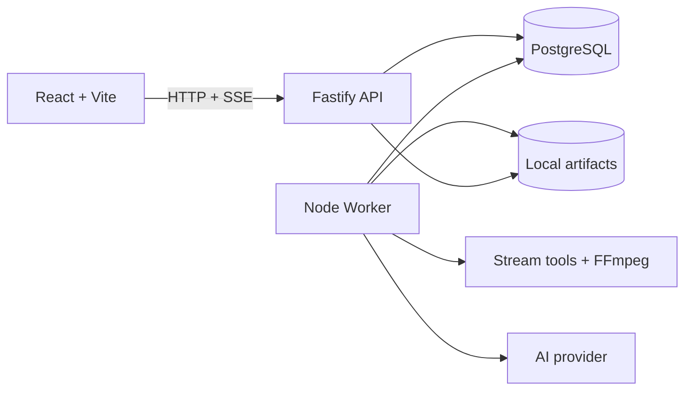
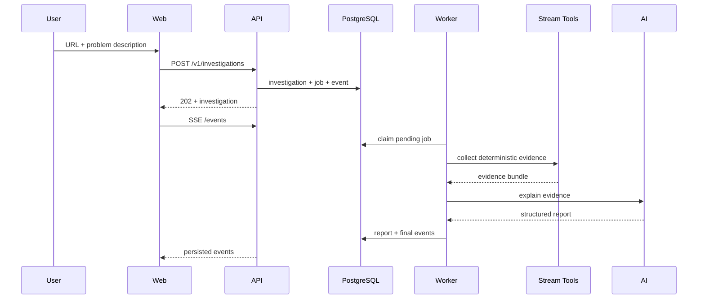

# Arquitetura - Video Harness Space

## Objetivo

Manter o MVP simples, testavel e evolutivo sem introduzir infraestrutura de escala
prematura.

## Visao de runtime



No deploy inicial, web, API, worker, PostgreSQL e Caddy executam no mesmo VPS por
Docker Compose.

## Arquitetura hexagonal leve

O objetivo e proteger o fluxo de investigacao de detalhes externos, nao maximizar
o numero de interfaces.

### Application core

Casos de uso esperados:

- `startInvestigation`;
- `runInvestigation`;
- `getInvestigation`;
- `streamInvestigationEvents`;
- `getReport`.

### Ports iniciais

- `InvestigationRepository`;
- `JobRepository`;
- `InvestigationEventRepository`;
- `ManifestCollector`;
- `InvestigationAI`;
- `ArtifactStore`.

### Adapters

- HTTP Fastify e SSE;
- worker que reclama jobs;
- PostgreSQL;
- stream tools internos;
- provider de IA;
- filesystem local.

Nao criar ports para logger, IDs, factories ou helpers sem uma necessidade de teste
ou troca concreta.

## Modelagem do pipeline

O mesmo conceito usa um modelo canonico enriquecido ao longo do fluxo. Para
manifests, `ManifestCollector` retorna `Manifest[]` com source, bytes e inspection;
o worker adiciona `artifact` ao mesmo objeto depois de gravar no storage. Somente a
fronteira do report cria `ManifestEvidence`, uma projecao sem bytes.

Nomes baseados apenas em etapas (`CollectedManifest`, `PromotedManifest`) devem ser
evitados. Tipos diferentes ficam reservados para fronteiras ou invariantes reais,
nao para cada chamada sequencial.

## Fluxo principal



## Estado e persistencia

PostgreSQL e a fonte de verdade para:

- investigations;
- jobs;
- investigation events;
- artifact metadata;
- reports.

O filesystem armazena arquivos, nunca o estado principal do workflow. Cada
investigacao usa um workspace isolado.

## Jobs

- Fila inicial no PostgreSQL.
- Claim com lease e `FOR UPDATE SKIP LOCKED`.
- Heartbeat do worker para jobs longos.
- Retry limitado e classificacao de falhas.
- Um job representa inicialmente o pipeline inteiro.
- Sem Redis ou queue framework no MVP.
- Claim seleciona jobs pendentes ou leases expirados com `FOR UPDATE SKIP LOCKED`.
- Cada claim incrementa `attempts`; jobs abandonados podem ser retomados ate
  `max_attempts`.
- Transicoes renovam o lease e persistem estado + evento atomicamente.
- Conclusao persiste report, investigation, job e evento na mesma transacao.

## Eventos

- Append-only por investigacao.
- ID monotono usado por SSE.
- Reconexao via `Last-Event-ID`.
- Eventos descrevem fatos e progresso, nao raciocinio oculto.
- O primeiro evento e persistido na mesma transacao da investigacao e do job.
- Na Fase 1, a API consulta novos eventos no PostgreSQL a cada 750ms por conexao
  SSE. Essa solucao e suficiente para um unico VPS e evita infraestrutura extra.
- O cursor e o ID persistido do evento; `Last-Event-ID` impede replay duplicado.

## Storage

Layout alvo:

```text
.video-harness-data/
  workspaces/<investigationId>/
  artifacts/<investigationId>/
```

Temporary files sao removidos ao final. Manifestos, evidencias selecionadas,
screenshots e reports podem ser promovidos para artifacts.

Artifacts promovidos possuem um `logical_key` estavel dentro da investigation,
como `manifest/root` ou `manifest/variant/0`. Um novo retry grava arquivos com
storage keys novos, substitui metadados do mesmo artifact logico em uma transacao
e somente entao remove os arquivos superados. Um lote que falha antes do commit
remove apenas os arquivos ainda nao registrados.

## Estrutura de codigo alvo

```text
src/
  api/
  worker/
  investigation/
    domain/
    application/
    ports/
    adapters/
  stream-tools/
  database/
  ai/
  infra/
ui/
prompts/
```

## Fronteira de rede para streams

- URLs aceitam somente HTTP(S) e nao podem conter credenciais embutidas.
- Todos os resultados DNS precisam ser publicos; resposta mista publica/privada e
  bloqueada.
- O Compose local configura somente `localhost` como alias explicito para
  `host.docker.internal`; esse bypass nao existe no runtime padrao nem autoriza
  IPs privados literais.
- A conexao usa diretamente o IP validado, preservando `Host` e SNI, para evitar
  uma segunda resolucao vulneravel a DNS rebinding.
- Cada redirect e manual, limitado e passa novamente pela validacao completa.
- Cada URI de variant/rendition HLS e tratada como uma nova entrada nao confiavel:
  DNS, IP, redirects, timeout e bytes sao revalidados do zero.
- Timeout cobre resolucao, headers e body; resposta tem limite estrito de bytes.
- Falhas deterministicas de policy/formato nao sao repetidas pelo worker.

## Amostragem HLS do MVP

- A master inteira e parseada sem baixar segmentos.
- Uma variant e selecionada por maior `BANDWIDTH`; empates preservam a ordem da
  master.
- No maximo uma rendition de audio do grupo vinculado e coletada, preferindo
  `DEFAULT=YES`, depois `AUTOSELECT=YES` e por fim a ordem da master.
- O lote e limitado a root + uma variant + uma rendition de audio.
- A playlist media selecionada, ou o root quando ele ja e uma media playlist, tem
  segmentos de inicio, meio e fim amostrados.
- Subtitles e outras variants permanecem somente como descritores ate uma
  hipotese justificar coleta adicional.

## Fases

- `phases/phase-0.md` - fundacao do produto.
- `phases/phase-1.md` - thin slice persistente.
- `phases/phase-2.md` - evidencias deterministicas.
- `phases/phase-3.md` - investigacao assistida por IA.
- `phases/phase-4.md` - experiencia premium.
- `phases/phase-5.md` - hardening e validacao.
