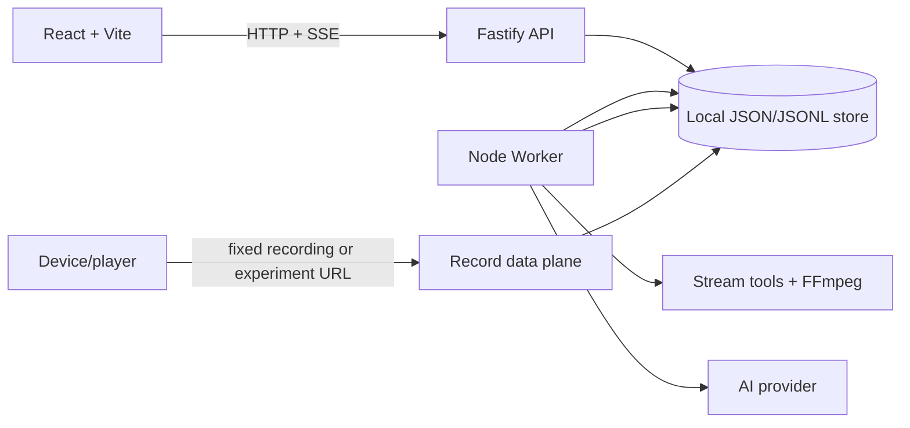
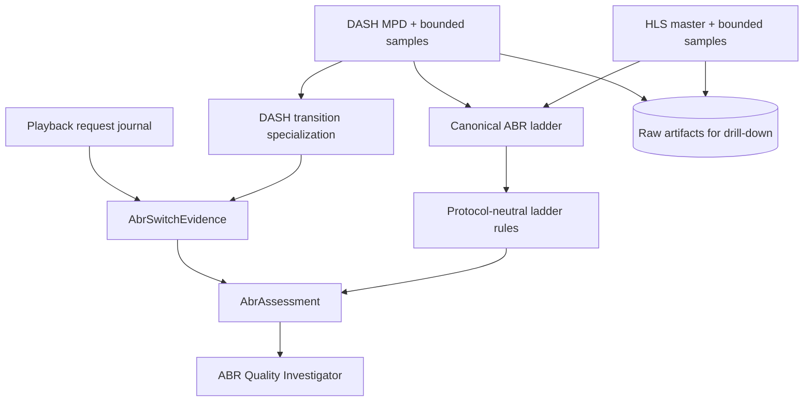
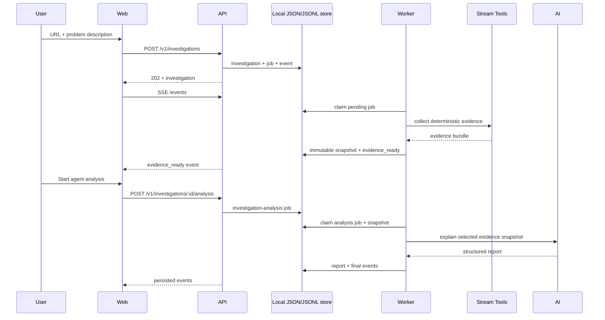
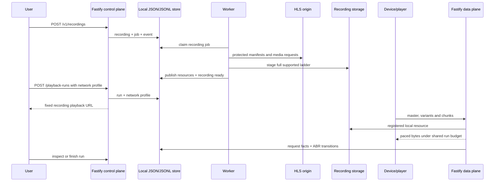
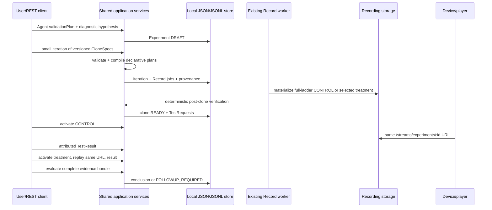

# Arquitetura - Video Harness Space

## Objetivo

Manter o MVP simples, testavel e evolutivo sem introduzir infraestrutura de escala
prematura.

## Visao de runtime



No deploy inicial, web, API, worker e lab executam no mesmo VPS por Docker
Compose, compartilhando um diretorio de dados local. Em Record R1, control plane
e data plane compartilham o runtime Fastify; nenhuma porta ou processo e criado
por recording.

## Arquitetura hexagonal leve

O objetivo e proteger os fluxos de investigacao e Record de detalhes externos,
nao maximizar o numero de interfaces.

### Application core

Casos de uso esperados:

- `startInvestigation`;
- `runInvestigation`;
- `startInvestigationAnalysis`;
- `runInvestigationAnalysis`;
- `getInvestigation`;
- `streamInvestigationEvents`;
- `getReport`;
- `startRecording`;
- `runRecording`;
- `createPlaybackRun`;
- `serveRecordedResource`;
- `finishPlaybackRun`.
- `createExperiment`;
- `compileCloneSpec`;
- `activateTestRequest`;
- `submitTestResult`;
- `evaluateExperiment`;
- `runExperimentEvaluation`;
- `assessStreamAbr`;
- `analyzeDashSwitchCandidates`;
- `correlateAbrSwitches`.

### Ports iniciais

- `InvestigationRepository`;
- `JobRepository`;
- `InvestigationEventRepository`;
- `ManifestCollector`;
- `InvestigationAI`;
- `ArtifactStore`;
- `RecordingRepository`;
- `RecordingJobRepository`;
- `RecordingStore`.
- `ExperimentRepository`;
- `ExperimentStreamResolver`.
- `ExperimentEvaluationJobRepository`;
- `ExperimentAnalysisTeam`;

### Adapters

- HTTP Fastify e SSE;
- worker que reclama jobs;
- PostgreSQL;
- stream tools internos;
- provider de IA;
- filesystem local;
- rotas de delivery para recursos gravados;
- shaper deterministico e journal PostgreSQL de requests.

Nao criar ports para logger, IDs, factories ou helpers sem uma necessidade de teste
ou troca concreta.

## Modelagem do pipeline

O mesmo conceito usa um modelo canonico enriquecido ao longo do fluxo. Para
manifests, `ManifestCollector` retorna `Manifest[]` com source, bytes e inspection;
o worker adiciona `artifact` ao mesmo objeto depois de gravar no storage. Somente a
fronteira do report cria `ManifestEvidence`, uma projecao sem bytes.

Nomes baseados apenas em etapas (`CollectedManifest`, `PromotedManifest`) devem ser
evitados. Tipos diferentes ficam reservados para fronteiras ou invariantes reais,
nao para cada chamada sequencial.

## Pipeline de diagnostico ABR



`AbrAssessment` e a raiz protocol-neutral do diagnostico e existe em toda
investigation HLS ou DASH. Ele explicita ladder, cobertura, verdict, findings,
transicoes disponiveis e proximas medicoes. O problema relatado muda somente a
prioridade; nao liga/desliga o baseline ABR.

`AbrSwitchEvidence` e uma especializacao de transicao com proveniencia explicita.
Uma investigation somente por URL gera `URL_STATIC_ANALYSIS/CANDIDATE`; um playback run gera
`PLAYBACK_NETWORK_OBSERVED/OBSERVED` apenas quando o journal mostra mudanca de
Representation. Texto do usuario pode conter contexto de qualquer player/device,
mas entra como `reportedPlayerContext`, separado de eventos e capability evidence.

O especialista recebe o assessment compacto e pode inspecionar amostras
preservadas. Para uma transicao ele recebe contrato, semantic INIT/parameter-set
diff, boundary, timeline, findings e summaries opcionais de delivery,
decode/conformance/device. Bytes completos permanecem fora do prompt.

A especialista `manifest-delivery` recebe, alem do pacote compartilhado, o texto
cru dos manifests coletados inline (campo `content` por logicalKey, limitado em
`build-manifest-evidence`). As demais agentes continuam com o pacote compacto; o
conteudo bruto permanece no evidence snapshot e e removido da projecao do report.

A especialista `timeline-playback` recebe, alem do pacote compartilhado, as
janelas deterministicas de continuidade de timeline (`timeline` com
gaps/overlaps por variant). O evidence index inclui `timeline:<key>` para que os
findings citem as janelas. Snapshots historicos sem o campo sao tratados como
limitacao explicita pela especialista.

Os especialistas compartilham uma unica credencial de provider e executam em
serie. O pacote inicial remove URLs e detalhes repetitivos de frames/NALs; esses
detalhes continuam preservados e ficam acessiveis somente pela ferramenta de
inspecao limitada. Retry de contrato e retry de provider usam politicas distintas,
com backoff para rate limit e sem repetir erros permanentes de auth/contexto.

## Fluxo principal



## Fluxo Record HLS VOD



`Recording` e uma origem imutavel e reutilizavel. `PlaybackRun` e uma execucao
com profile e evidencia proprios. Um run nunca altera os bytes gravados.

## Fluxo de Experiment



`Experiment` e a abstracao diagnostica; `ExperimentClone` referencia um
`Recording` como tratamento controlado. O modulo `experiment/` nao duplica
download, storage, fila ou data plane: ele compila selecoes para o contrato do
Record, observa seu lifecycle e mantem hipoteses/results/evaluation. UI e REST
chamam o mesmo application service.

O URL do experiment e permanente. `active_test_request_id` seleciona qual
recording publicado a rota entrega. Essa selecao e controle, nao mutacao dos bytes;
paths continuam locais e registrados, sem origin fetch. `TestResult` e sempre uma
observacao atribuida e nunca e derivado de metadata ou texto remoto.

## Estado e persistencia

PostgreSQL e a fonte de verdade para:

- investigations;
- jobs;
- investigation events;
- artifact metadata;
- reports.
- recordings, recording jobs e recording events;
- recorded resource metadata;
- playback runs e delivery requests.
- experiments, hypotheses, iterations, experimental clones, test environments,
  test requests/results e evaluations.

O filesystem armazena arquivos, nunca o estado principal do workflow. Cada
investigacao ou recording usa um workspace isolado.

## Jobs

- Fila inicial no PostgreSQL.
- Claim com lease e `FOR UPDATE SKIP LOCKED`.
- Heartbeat do worker para jobs longos.
- Retry limitado e classificacao de falhas.
- `investigation` representa somente coleta deterministica;
  `investigation-analysis` representa a analise explicitamente solicitada.
- Sem Redis ou queue framework no MVP.
- Claim seleciona jobs pendentes ou leases expirados com `FOR UPDATE SKIP LOCKED`.
- Cada claim incrementa `attempts`; jobs abandonados podem ser retomados ate
  `max_attempts`.
- Transicoes renovam o lease e persistem estado + evento atomicamente.
- A conclusao da coleta persiste `evidence_ready`, job e evento na mesma
  transacao; a conclusao da analise persiste report, investigation, job e evento.

Record usa `recording_jobs` porque a tabela `jobs` atual exige
`investigation_id`. O contrato pequeno de claim, lease, heartbeat e retry e
repetido sem transformar jobs em uma abstracao polimorfica prematura.

## Eventos

- Append-only por investigacao.
- ID monotono usado por SSE.
- Reconexao via `Last-Event-ID`.
- Eventos descrevem fatos e progresso, nao raciocinio oculto.
- O primeiro evento e persistido na mesma transacao da investigacao e do job.
- Na Fase 1, a API consulta novos eventos no PostgreSQL a cada 750ms por conexao
  SSE. Essa solucao e suficiente para um unico VPS e evita infraestrutura extra.
- O cursor e o ID persistido do evento; `Last-Event-ID` impede replay duplicado.

Record possui `recording_events` append-only e a mesma semantica de replay SSE.
Delivery requests nao entram nessa timeline: formam um journal proprio, paginado
e limitado ao playback run.

## Storage

Layout alvo:

```text
.video-harness-data/
  workspaces/<investigationId>/
  artifacts/<investigationId>/
  recording-workspaces/<recordingId>/
  recordings/<recordingId>/
```

Temporary files sao removidos ao final. Manifestos, evidencias selecionadas,
screenshots e reports podem ser promovidos para artifacts.

Artifacts promovidos possuem um `logical_key` estavel dentro da investigation,
como `manifest/root` ou `manifest/variant/0`. Um novo retry grava arquivos com
storage keys novos, substitui metadados do mesmo artifact logico em uma transacao
e somente entao remove os arquivos superados. Um lote que falha antes do commit
remove apenas os arquivos ainda nao registrados.

Recordings usam staging e publish atomico no mesmo filesystem. O data plane serve
somente logical paths presentes em `recorded_resources`; paths do device nunca
viram URL externa nem provocam fetch sob demanda.

## Estrutura de codigo alvo

```text
src/
  api/
  worker/
  investigation/
    domain/
    application/
    ports/
    adapters/
  stream-tools/
  record/
    domain/
    application/
    ports/
    adapters/
    stream-tools/
  experiment/
    domain/
    application/
    ports/
    adapters/
  abr/
    domain/
    application/
    adapters/
  agents/
    domain/
    application/
    ports/
    adapters/
  store/
  ai/
  infra/
ui/
prompts/
```

## Record HLS VOD e simulacao ABR

- O clone materializa toda a ladder suportada dentro de uma janela limitada.
- Cada URI derivada passa pela mesma protecao SSRF, DNS/IP pinning, redirect,
  timeout e limite de bytes usada na investigacao.
- A janela e validada entre variants antes da publicacao; misalignment que torne
  o playback incorreto bloqueia o recording ou aparece como limitacao explicita.
- Cada recording expoe uma URL de playback fixa em
  `/streams/recordings/:recordingId/*`; cada request resolve o run aberto atual
  para aplicar shaping e gravar o journal, e sem run ativo o clone e servido com
  o perfil baseline. Respostas usam `Cache-Control: no-store`.
- Throughput e compartilhado por video, audio e demais respostas concorrentes do
  run. Latencia e aplicada por request e bytes sao enviados progressivamente.
- O clock do profile comeca no primeiro request de media.
- Requests persistem variant, bitrate, resolucao, sequence, stage, bytes e tempos.
- Troca ABR observada significa mudanca de variant nos requests. Decode/render
  permanece `not_measured` sem telemetria do device.
- HLS VOD clear/MPEG-TS e Record R1; DASH VOD clear/fMP4 e Record R2.

O plano completo esta em
`docs/planning/RECORD-ABR-IMPLEMENTATION-PLAN.md`.

## Fronteira de rede para streams

- URLs aceitam somente HTTP(S) e nao podem conter credenciais embutidas.
- Todos os resultados DNS precisam ser publicos; resposta mista publica/privada e
  bloqueada.
- O Compose local configura somente `localhost` como alias explicito para
  `host.docker.internal`; esse bypass nao existe no runtime padrao nem autoriza
  IPs privados literais.
- A conexao usa diretamente o IP validado, preservando `Host` e SNI, para evitar
  uma segunda resolucao vulneravel a DNS rebinding.
- Cada redirect e manual, limitado e passa novamente pela validacao completa.
- Cada URI de variant/rendition HLS e tratada como uma nova entrada nao confiavel:
  DNS, IP, redirects, timeout e bytes sao revalidados do zero.
- Timeout cobre resolucao, headers e body; resposta tem limite estrito de bytes.
- Falhas deterministicas de policy/formato nao sao repetidas pelo worker.

## Amostragem HLS do MVP

- A master inteira e parseada sem baixar segmentos.
- Uma variant e selecionada por maior `BANDWIDTH`; empates preservam a ordem da
  master.
- No maximo uma rendition de audio do grupo vinculado e coletada, preferindo
  `DEFAULT=YES`, depois `AUTOSELECT=YES` e por fim a ordem da master.
- O lote e limitado a root + uma variant + uma rendition de audio.
- A playlist media selecionada, ou o root quando ele ja e uma media playlist, tem
  seus segmentos coletados conforme o modo configurado por
  `VIDEO_HARNESS_MEDIA_SAMPLE_MODE`:
  - `full` (padrao): uma janela contigua de ate `VIDEO_HARNESS_MEDIA_SAMPLE_MAX_SECONDS`
    (padrao 60s) por variant, centrada no horario de incidente relatado quando
    existir; sem horario, a janela parte do inicio da playlist.
  - `sample`: baixa somente os segmentos de inicio, meio e fim.
- O tempo declarado no manifest guia a selecao; os limites de bytes
  (`VIDEO_HARNESS_MEDIA_SAMPLE_MAX_TOTAL_BYTES` e
  `VIDEO_HARNESS_MEDIA_SAMPLE_MAX_BYTES`) sao redes de seguranca contra abuso e
  memoria, nao definem a cobertura normal.
- Subtitles e outras variants permanecem somente como descritores ate uma
  hipotese justificar coleta adicional.

## Fases

- `phases/phase-0.md` - fundacao do produto.
- `phases/phase-1.md` - thin slice persistente.
- `phases/phase-2.md` - evidencias deterministicas.
- `phases/phase-3.md` - investigacao assistida por IA.
- `phases/phase-4.md` - experiencia premium.
- `phases/phase-5.md` - hardening e validacao.
- `phases/phase-investigation-workspace.md` - fase ativa: evidencia visual,
  agentes e loop de hipoteses.
- `phases/phase-record-hls-vod.md` - fase ativa de Record R1.
- `phases/phase-record-dash-vod.md` - extensao planejada Record R2.
