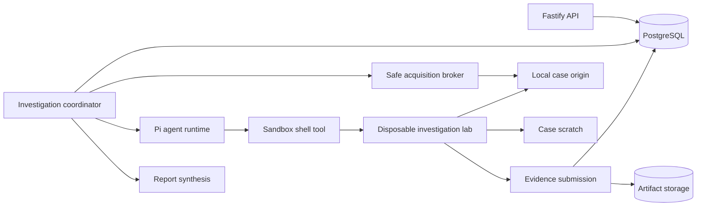

# Agentic Investigation Lab

Status: **proposta para a proxima evolucao da Fase 2/3**

## Decisao de produto

O Video Harness deve executar uma investigacao de verdade, nao apenas sintetizar
um pacote fechado de probes predefinidas.

O investigador principal tera um shell real dentro de um laboratorio descartavel
e isolado por investigation. Ele podera combinar ferramentas, escrever scripts,
inspecionar resultados intermediarios e criar novas medicoes que nao foram
previstas pelo application core.

O limite de seguranca fica ao redor do laboratorio, nao ao redor da inteligencia:

- liberdade para executar codigo e processos dentro do caso;
- nenhuma autoridade sobre o host, banco, segredos ou outros casos;
- nenhuma URL fornecida pelo usuario interpolada em comandos;
- acesso externo somente pela fronteira protegida de aquisicao;
- limites de CPU, memoria, disco, processos, tempo e bytes;
- comandos, resultados e evidencias auditaveis.

Sem essa capacidade, o modelo e apenas um analista de evidencias existentes. O
objetivo do VHS exige um investigador capaz de produzir a proxima evidencia.

## Resultado esperado

```text
URL + problema relatado
  -> aquisicao protegida e workspace local
  -> baseline deterministico
  -> especialistas formulam hipoteses e lacunas
  -> agente usa shell para criar medicoes discriminatorias
  -> novas evidencias atualizam e contradizem hipoteses
  -> loop encerra por cobertura, impossibilidade ou budget
  -> relatorio excelente, reproduzivel e auditavel
```

O criterio principal nao e quantidade de comandos nem quantidade de findings. E
reduzir o `time to useful explanation` com uma conclusao tecnicamente defensavel.

## Principios

1. O agente pode executar comandos arbitrarios dentro do laboratorio.
2. O laboratorio nunca recebe credenciais da API, banco, storage ou provider.
3. A midia e adquirida por uma fronteira SSRF-safe antes de virar input local.
4. O shell recebe paths locais normalizados, nunca a URL bruta como argumento.
5. Toda afirmacao tecnica do report cita uma evidencia persistida.
6. Comandos e scripts sao atividades auditaveis, nao chain of thought.
7. Resultados negativos tambem sao evidencias quando a cobertura e conhecida.
8. O agente pode criar uma medicao nova sem alterar o catalogo do produto.
9. A investigacao completa e progressiva: breadth scan primeiro, deep scan onde
   o sintoma ou uma anomalia justificar.
10. Budget limita recursos; nao limita previamente a estrategia intelectual.

## Arquitetura alvo



### Coordenador

O worker continua dono do lifecycle, lease, heartbeat, retries e transacoes. Ele:

- cria o workspace do caso;
- pede aquisicoes ao broker;
- inicia e encerra o laboratorio;
- entrega shell ao runtime Pi;
- persiste agent runs, shell runs, evidencias e eventos;
- aplica budgets e stop conditions;
- publica o report.

O agente nao recebe acesso direto ao PostgreSQL nem ao `ArtifactStore`.

### Safe acquisition broker

O broker e a unica fronteira com a origem externa. Ele reutiliza a policy atual:

- DNS e IP validados;
- conexao com destino fixado;
- redirects revalidados;
- timeout e limite de bytes;
- limites agregados por investigation;
- aliases privados apenas quando explicitamente configurados;
- nomes locais gerados pelo VHS, sem paths derivados diretamente da URI.

O broker deve materializar um origin local navegavel:

```text
/case/input/
  source.json
  root.m3u8
  manifests/
  media/
  init/
  index.json
```

`index.json` relaciona paths locais, logical keys, URLs sanitizadas, sequencias,
duracoes, tracks e status de aquisicao. O shell trabalha somente com esse indice
e os arquivos locais.

Quando o agente precisar de bytes ainda nao coletados, ele solicita uma aquisicao
por logical key, janela temporal, playlist ou representation. A solicitacao passa
novamente pelo broker; o shell nao ganha `curl` livre para a internet.

### Laboratorio descartavel

Cada investigation recebe um ambiente efemero com:

- imagem fixa e versionada;
- usuario sem privilegios;
- root filesystem read-only;
- `/case/input` read-only;
- `/case/work` e `/tmp` gravaveis e limitados;
- capabilities removidas;
- `no-new-privileges`;
- limites de PID, CPU, memoria e disco;
- timeout por comando e deadline global;
- sem Docker socket;
- sem mounts do source code, `.env`, banco ou outros casos;
- sem variaveis de ambiente secretas;
- sem egress direto.

No deploy Docker Compose, um `sandbox-controller` pequeno pode criar containers
efemeros a partir de uma especificacao fixa. O controller e a unica peca com
acesso ao runtime de containers e nao aceita imagem, mounts, capabilities,
network ou entrypoint escolhidos pelo agente.

O container do agente nunca recebe acesso ao controller.

### Shell do agente

O runtime oferece uma experiencia de shell real:

- iniciar comando;
- receber stdout/stderr incremental;
- continuar processos longos;
- enviar stdin;
- encerrar processo;
- listar arquivos produzidos;
- promover scripts, logs e resultados selecionados.

O agente pode usar pipes, redirecionamentos e scripts dentro do laboratorio. Cada
execucao persiste:

- agent run e round;
- comando ou script;
- cwd;
- hashes dos inputs conhecidos;
- inicio, fim, exit code e timeout;
- consumo de recursos;
- stdout/stderr limitado ou artifact de log;
- arquivos promovidos;
- versoes das ferramentas.

O comando pode aparecer na auditoria tecnica, mas a UX principal mostra a
atividade e a medicao em linguagem humana.

### Evidencia estruturada

Shell output bruto nao vira fato automaticamente. O agente registra uma evidencia
por uma fronteira estruturada, por exemplo:

```json
{
  "kind": "video_freeze",
  "scope": {
    "manifestLogicalKey": "manifest/root",
    "startSeconds": 2.96963,
    "endSeconds": 4.97163
  },
  "facts": {
    "durationSeconds": 2.002,
    "detector": "ffmpeg.freezedetect",
    "noiseDb": -50,
    "minimumDurationSeconds": 0.5
  },
  "sourceShellRunIds": ["uuid"],
  "artifactIds": ["uuid"],
  "limitations": []
}
```

O coordenador valida schema, IDs, tamanhos e ownership antes de persistir. O
report cita o ID dessa evidencia, nao um trecho solto de stdout.

## Loop investigativo

### 1. Baseline

O baseline sempre coleta fatos baratos e amplos:

- protocolo e topologia de manifests;
- variants, representations e renditions;
- sequencias, duracoes, encryption e discontinuities;
- headers/status/timings de aquisicao disponiveis;
- tracks, codecs e propriedades basicas;
- amostra inicial de timeline e decodabilidade;
- contexto estruturado extraido do problema relatado.

### 2. Hipoteses iniciais

Especialistas produzem:

- findings observados;
- hipoteses concorrentes;
- evidencias favoraveis e contraditorias;
- lacunas de cobertura;
- medicoes capazes de mudar o ranking.

O relato orienta prioridade, mas nao e tratado como fato.

### 3. Exploracao com shell

O agente escolhe a estrategia. Exemplos:

- executar `freezedetect` em uma janela continua;
- gerar frame hashes e comparar frames repetidos;
- escrever um parser de logs ou packets;
- correlacionar PTS/DTS entre tracks;
- decodificar todos os segmentos e agrupar erros por boundary;
- comparar extradata, SPS/PPS, profile/level ou init segments;
- testar keyframes e independencia de cada segmento;
- medir silencio, black frames, clipping ou loudness;
- montar CSVs e scripts para localizar a primeira anomalia;
- testar uma hipotese que ainda nao possui ferramenta dedicada.

Ferramentas dedicadas continuam valiosas como atalhos, exemplos e parsers
confiaveis. Elas nao sao o teto da investigacao.

### 4. Atualizacao

Cada nova evidencia pode:

- confirmar uma hipotese;
- contradizer uma hipotese;
- localizar melhor o intervalo;
- reduzir uma causa generica para uma camada especifica;
- justificar outra medicao.

Somente especialistas afetados precisam ser executados novamente.

### 5. Encerramento

O loop termina quando:

- uma hipotese tem cobertura suficiente e contradicoes tratadas;
- nenhuma medicao disponivel mudaria materialmente a conclusao;
- a origem nao fornece os bytes necessarios;
- criptografia/DRM impede a observacao;
- o budget termina;
- ferramentas falham de forma deterministica.

Budget esgotado produz limitacao explicita, nunca falsa conclusao.

## Analise do video completo

“Completo” depende do tipo de stream:

### VOD finito

1. Descobrir duracao, quantidade de segmentos e estimativa de bytes.
2. Executar breadth scan em todas as playlists relevantes e todos os segmentos.
3. Executar deep decode completo quando o sintoma for de conteudo, corrupcao ou
   quando o tamanho couber no budget.
4. Usar janelas contiguas com overlap para detectar eventos que cruzam boundaries.
5. Unir eventos adjacentes produzidos por segmentos diferentes.
6. Preservar somente evidencias e artifacts selecionados; limpar o restante.

Para assets grandes, o broker usa cache deslizante: baixa, analisa, promove o que
importa e libera bytes intermediarios. Analise completa nao exige preservar uma
copia completa para sempre.

### Live

Live nao possui “fim”. O report declara uma janela observada:

- acompanhar varias atualizacoes do manifest;
- verificar progressao de media sequence e freshness;
- medir disponibilidade e latencia dos novos segmentos;
- analisar uma janela temporal configuravel;
- capturar mudancas de variant/rendition e discontinuities;
- encerrar com cobertura temporal explicita.

### Boundaries

Analises perceptuais nao devem tratar cada segmento como um universo isolado.
Uma janela deve incluir o segmento anterior e posterior quando necessario.
Freeze, silence, decode state, GOP e mudancas de configuracao podem atravessar a
boundary.

### Variants e renditions

O baseline pode escolher uma representacao, mas o agente pode ampliar a coleta
quando a hipotese envolver:

- comportamento ABR;
- diferenca entre qualities;
- audio alternativo;
- codec/resolucao especificos;
- ladder inconsistente;
- defeito presente apenas em uma representation.

## Imagem do laboratorio

Primeiro conjunto:

- `bash`, coreutils, `find`, `sed`, `awk`, `jq`;
- Node.js e Python para scripts locais;
- FFmpeg e FFprobe;
- MediaInfo;
- Bento4 (`mp4dump`, `mp4info`, `mp4fragment`);
- GPAC/MP4Box;
- TSDuck para MPEG-TS;
- ferramentas de hash e checksums;
- `file`, `xxd` e utilitarios de compressao limitados.

Evolucao orientada por casos:

- Shaka Packager para inspecao de packaging/DRM metadata;
- analyzers de captions;
- parsers de H.264/H.265/AV1;
- metricas perceptuais sem referencia;
- Chromium/Playwright em sandbox separado para playback controlado.

Todas as versoes entram na identidade da imagem e na auditoria da evidence.

## Cobertura tecnica desejada

### Manifest e delivery

- HLS master/media e DASH MPD;
- LL-HLS e live refresh;
- ladder, renditions, groups e languages;
- media/discontinuity sequence;
- EXTINF versus duracao observada;
- init/map, byte ranges e encryption metadata;
- URIs ausentes, HTTP status, redirects e CORS;
- cache headers, Age/ETag, freshness e throughput quando observados;
- disponibilidade de segmento versus target duration.

### Container, codec e timeline

- demux e decode completo;
- PTS, DTS, PCR, gaps, overlaps, resets e regressao;
- MPEG-TS continuity counters;
- duracao declarada versus observada;
- keyframes, IDR, GOP e independencia de segmento;
- SPS/PPS/VPS, extradata, profile, level e mudancas de configuracao;
- init segments e fragmentos fMP4;
- tracks ausentes, inesperados ou corrompidos;
- comparacao entre variants/renditions.

### Conteudo perceptual

- freeze e frames repetidos;
- black frames;
- silence e dropouts;
- clipping e loudness;
- frame drops e cadencia anormal;
- blur/blockiness quando houver detector confiavel;
- cor, HDR e range metadata;
- captions presentes e continuidade;
- erros de decode localizados.

### Playback

- startup;
- stalls e stall duration;
- buffer;
- fragment requests e erros;
- quality switches;
- decoded/dropped/corrupted frames;
- progressao de `currentTime` versus frames renderizados;
- compatibilidade observada no browser;
- separacao entre problema contido na midia e comportamento do player.

### Compatibility

- container/codec/profile/level;
- resolucao, frame rate, bit depth e color space;
- audio codec, sample rate e channel layout;
- regras explicitas por familia de browser/device;
- limitacao clara: regra de compatibilidade nao equivale a teste em device real.

## Agentes

Especialistas recomendados:

- Timeline & Clock;
- Audio/Video Signal;
- Segment, Container & GOP;
- Manifest & Delivery;
- Playback & Compatibility;
- Lead Investigator.

Cada especialista pode receber shell em scratch separado e input read-only. O Lead
recebe todas as evidencias e pode executar medicoes finais. Um cache global do
caso evita repetir comandos equivalentes sobre os mesmos hashes de input.

O output de especialista deve conter:

- findings;
- hipoteses concorrentes;
- supporting/contradicting evidence IDs;
- coverage;
- unresolved questions;
- requested measurements.

O Lead nao escolhe por maioria; escolhe por cobertura e poder explicativo.

## Persistencia e recuperacao

Novos conceitos persistidos:

- `agent_runs`: papel, round, prompt/model revision, estado, output estruturado;
- `shell_runs`: comando/script, sandbox, estado, consumo, outputs e artifacts;
- `evidence_items`: fatos estruturados, scope, producer e citations;
- `investigation_budgets`: limites e consumo acumulado.

Jobs continuam sendo a unidade recuperavel do pipeline. Em restart:

- containers orfaos sao encerrados;
- shell runs interrompidos viram `interrupted`;
- evidencias ja confirmadas permanecem;
- o novo agent run recebe um checkpoint composto por evidencias, hipoteses e
  lacunas persistidas;
- comandos idempotentes podem reutilizar resultados pelo hash de inputs +
  script/comando + versao da imagem.

Nao e necessario persistir raciocinio oculto para recuperar a investigacao.

## Timeline e UX

Eventos mostram trabalho real:

- “Cloning 15 media segments into an isolated lab.”
- “Checking frames from 0s–8s for visual repetition.”
- “Freeze observed from 2.97s to 4.97s.”
- “Comparing the HLS boundary at 4.00s.”
- “Decode validation completed for all 15 segments.”
- “Hypothesis updated: delivery stall contradicted by continuous audio/video
  timestamps and confirmed repeated frames.”

Comandos e logs ficam em progressive disclosure. A pagina principal mostra:

- atividade;
- motivo declarado da medicao;
- scope;
- resultado;
- evidence ID;
- custo/coverage quando relevante.

Nao mostrar chain of thought, tokens internos ou stdout bruto como narrativa.

## Seguranca

O threat model inclui:

- URL maliciosa e SSRF;
- manifest/metadata contendo prompt injection;
- filenames e paths maliciosos;
- media criada para explorar FFmpeg/parsers;
- comandos destrutivos gerados pelo agente;
- fork bomb e consumo de recursos;
- leitura de segredos por `/proc` ou environment;
- exfiltracao pela rede;
- acesso a artifacts de outra investigation;
- outputs enormes;
- container orfao depois de restart.

Controles obrigatorios:

- isolation por case;
- usuario sem privilegios;
- sem segredos e sem egress;
- mounts minimos;
- root read-only;
- quotas e cgroups;
- limite de processos;
- seccomp/AppArmor ou equivalente;
- deadline e kill da arvore;
- validacao de paths e UUIDs no controller;
- output truncado com artifact opcional;
- atualizacao frequente da imagem;
- fixtures adversariais.

Permitir shell no processo atual do worker nao e aceitavel: ele possui database
URL, API key, acesso a todos os artifacts e rede.

## Budgets

Budgets sao configuraveis e registrados por investigation:

- bytes de manifest/media baixados;
- bytes preservados;
- workspace temporario;
- CPU seconds;
- memoria maxima;
- wall clock;
- processos simultaneos;
- comandos;
- output de comandos;
- chamadas/model tokens;
- duracao de live observation.

O default deve permitir uma investigacao util, nao uma amostra simbolica. Para um
VOD curto, analisar todos os segmentos deve ser o comportamento normal.

## Mudancas de contrato necessarias

Uma implementacao desta proposta exige:

- `EvidenceBundle` v4 com evidence index, scopes, producers e coverage;
- report com hipoteses, contradicoes, causal chain e unresolved evidence;
- eventos de shell/evidence/hypothesis;
- endpoints somente leitura para evidence e artifacts selecionados;
- migrations para agent/shell/evidence runs;
- ADR para o laboratorio shell-native;
- revisao da regra de processos no `AGENTS.md`.

A regra revisada deve continuar proibindo interpolar input do usuario em shell no
host. A excecao explicita e o shell arbitrario dentro do sandbox descartavel,
operando sobre paths locais gerados pelo VHS e sem segredos/egress.

## Roadmap

### Slice 1 - Provar o agente shell-native

- criar fixture HLS MPEG-TS com freeze de `2.96963s` a `4.97163s`, cruzando uma
  boundary em `4.004s`;
- materializar o VOD curto completo no workspace;
- criar `InvestigationLab` e shell com timeout/output limit;
- entregar shell ao Lead;
- permitir `ffmpeg`, scripts e evidence submission;
- persistir shell run e `video_freeze` evidence;
- reportar o freeze como observado.

Definition of Done:

- a investigation que motivou esta proposta deixa de ser inconclusiva;
- o agente escolhe e executa a medicao;
- o teste nao depende de procurar a palavra `freeze` em output inventado;
- comando, resultado e evidence citation sao auditaveis;
- nenhum segredo ou rede externa existe no lab.

### Slice 2 - Recuperacao e sandbox de producao

- container efemero por case;
- sandbox controller com especificacao fixa;
- agent runs, shell runs, evidence items e budgets no PostgreSQL;
- kill/recovery de runs interrompidos;
- cache idempotente;
- eventos SSE reais.

### Slice 3 - Trazer o breadth scan do VHS/Kael

- clone HLS completo sob budget;
- todos os segmentos de VOD curto;
- PTS/DTS, keyframes, GOP, duration delta e A/V offset series;
- manifest boundary inspection;
- decode validation;
- freeze, black e silence como receitas iniciais, sem limitar o shell;
- origem e adaptacoes registradas no README do modulo.

### Slice 4 - Investigacao iterativa multiagente

- especialistas com ownership claro;
- hipoteses concorrentes e requested measurements;
- rounds de evidencia;
- rerun seletivo;
- Lead com shell final;
- stop conditions baseadas em coverage e contradicoes.

### Slice 5 - Full media, live e ladder

- cache deslizante para VOD grande;
- live observation;
- outras variants/renditions sob hipotese;
- byte ranges e CMAF;
- AES-128 efemero;
- DASH;
- telemetria de delivery.

DRM com licenca permanece uma fronteira separada: metadata pode ser inspecionada,
mas decryption exige autorizacao e integracao explicitas.

### Slice 6 - Playback e compatibility

- ampliar telemetria hls.js;
- frames renderizados versus tempo;
- buffer e request timings;
- browser sandbox opcional;
- regras de compatibility versionadas;
- separar comprovacao em browser de inferencia por matriz.

### Slice 7 - Evals e hardening

Suite de streams conhecidos:

- freeze cruzando boundary;
- freeze com overlay ruidoso;
- black frame;
- silence/dropout;
- decode corruption;
- segmento sem keyframe;
- GOP longo;
- PTS gap/overlap/reset;
- A/V offset constante;
- A/V drift;
- discontinuity corretamente e incorretamente sinalizada;
- variant defeituosa isolada;
- live manifest parado;
- HTTP 404/timeout/redirect malicioso;
- media adversarial contra parsers.

Metricas:

- symptom detection recall;
- false positive rate;
- evidence citation validity;
- root-cause ranking;
- contradiction handling;
- coverage;
- custo e tempo;
- recovery after interruption;
- sandbox escape/security tests.

## Ordem recomendada

Comecar por Slice 1 e 2. Nao ampliar a UI nem adicionar dezenas de recipes antes
de provar que o agente consegue:

1. entrar em um lab seguro;
2. investigar livremente;
3. produzir uma evidencia nova;
4. atualizar a conclusao;
5. deixar uma trilha reproduzivel.

Essa e a nova fundacao do Video Harness.
