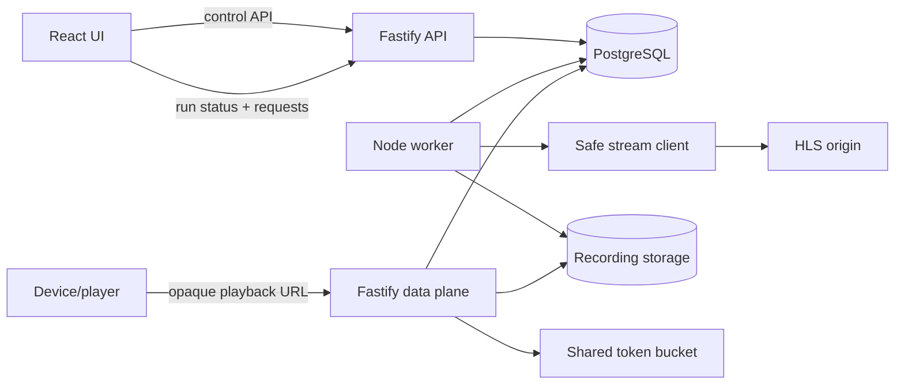

# Plano de Implementacao - Record e Simulacao ABR

Status: **aprovado para implementacao**.

Fase ativa: **Record R1 - HLS VOD + simulacao ABR**.

Fase seguinte: **Record R2 - DASH VOD**.

## Objetivo

Entregar um fluxo reproduzivel no qual o usuario informa uma URL HLS VOD, o
Video Harness materializa uma janela limitada de toda a ladder, publica uma URL
local para um device real e controla a entrega dos bytes para induzir decisoes
ABR observaveis pelos requests.

```text
URL HLS VOD
  -> recording recuperavel de manifests + variants + renditions + chunks
  -> origem local imutavel
  -> playback run com perfil de rede
  -> URL reproduzivel para o device
  -> journal de requests
  -> trocas ABR observadas e correlacionadas com o perfil aplicado
```

O Video Harness comprova qual representation o device requisitou. Sem telemetria
do player, nao afirma que essa representation foi decodificada ou renderizada.

## Decisoes de recorte

### Record R1

- HLS VOD com master playlist.
- MPEG-TS clear no primeiro slice funcional.
- Duas ou mais variants de video materializadas.
- Rendition de audio vinculada quando necessaria para playback.
- Janela configuravel e limitada; default inicial de 120 segundos.
- Uma origem gravada pode gerar varios playback runs.
- Profiles deterministas de throughput e latencia.
- Evidencia baseada em requests reais do device.

### Fora de R1

- live recording e acompanhamento continuo de playlist;
- AES-128, SAMPLE-AES e DRM;
- LL-HLS;
- `EXT-X-BYTERANGE` e init segment com byte range;
- packet loss e reordering;
- simulacao ou emulacao do device;
- CDN, cache distribuido ou multiplos servidores.

### Record R2

- DASH VOD estatico e clear;
- `SegmentTemplate` com `SegmentTimeline` ou duration;
- fMP4 com init + media segments;
- representations de video e audio;
- a mesma fronteira de playback run, shaping e request evidence criada em R1.

## Budgets iniciais de R1

Defaults configuraveis, sempre sujeitos a hard caps no backend:

- janela default 120 s, maximo 600 s;
- ladder selecionada completa, ate 32 variants/representations como teto de
  seguranca; renditions vinculadas continuam sujeitas aos budgets de recursos e
  bytes;
- manifest: 1 MiB por response;
- media/init: 64 MiB por response;
- recording: 1 GiB agregado;
- ate 5.000 recursos registrados;
- ate 3 downloads de origem concorrentes;
- timeout de 60 s por media response;
- playback run de ate 900 s e 8 responses concorrentes;
- no maximo 10.000 delivery requests persistidas por run;
- bytes entregues por run limitados ao menor valor entre quatro vezes o tamanho
  do recording e 4 GiB, incluindo retries/ranges.

Ao atingir budget, o recording falha antes do publish ou declara cobertura menor
somente quando os manifests locais ainda formarem uma origem consistente. Nunca
publicar uma ladder que referencia recurso ausente.

## Modelo de dominio

### Recording

Representa uma copia imutavel e limitada da origem.

Campos minimos:

- `id`;
- `sourceUrl`;
- `protocol`;
- `state`: `queued | validating | collecting | ready | failed`;
- janela solicitada e cobertura efetiva;
- bytes totais;
- ladder gravada;
- manifest de entrada do servidor local;
- timestamps e falha publica opcional.

Um retry pode reconstruir o workspace temporario, mas somente publica um recording
quando manifests, recursos e metadata estiverem consistentes.
HLS e DASH repetem falhas transitorias de media no nivel do recurso antes de
consumir uma nova tentativa do job inteiro; cada retry continua limitado e
observavel sem registrar a URL assinada.

### RecordedResource

Modelo canonico de cada arquivo publicado:

- papel: master, media playlist, init, video segment, audio segment ou subtitle;
- caminho logico local;
- variant/rendition vinculada;
- media sequence e indice original quando aplicavel;
- bitrate, resolucao e codecs conhecidos;
- tamanho, hash e content type;
- storage key interno.

O data plane nunca resolve uma URL de origem a partir do path pedido pelo device.
Ele serve somente recursos previamente registrados.

### PlaybackRun

Representa um experimento sobre um recording pronto.

- `id` e `recordingId`;
- URL de playback fixa por recording em `/streams/recordings/:recordingId/*`;
  cada request resolve o run aberto atual para shaping e journal;
- profile de rede versionado;
- `state`: `created | active | completed | expired | failed`;
- inicio ancorado no primeiro request de media;
- expiracao e limite de duracao;
- resumo das trocas observadas.

A URL nao muda entre runs; sem run ativo o clone e servido com o perfil
baseline.

### DeliveryRequest

Fato append-only por request:

- run e ordinal;
- instante de inicio/fim;
- resource kind e path logico;
- variant/rendition, bitrate, resolucao e media sequence;
- stage de rede aplicado;
- latency e throughput configurados;
- bytes enviados, status, cancelamento e duracao;
- metodo e suporte a range;
- user-agent limitado e endereco redigido conforme policy.

Query strings, tokens, headers sensiveis e paths internos nao entram na evidencia.

### AbrTransition

Projecao deterministica derivada de `DeliveryRequest`:

- `observed`: primeiro request de video em outra variant;
- `sustained`: dois chunks de video consecutivos e monotonicamente posteriores na
  nova variant;
- direcao: `upshift | downshift | lateral`;
- variant anterior e nova;
- stage ativo e tempo relativo ao primeiro media request.

Requests de audio, subtitle, manifest, retry duplicado ou init segment nao contam
como troca de video.

## Perfil de rede v1

O profile usa stages ordenados por quantidade de requests de video iniciadas. O
primeiro stage sempre comeca em zero. Esse trigger e reproduzivel mesmo quando o
device demora para abrir a URL.

```json
{
  "schemaVersion": 1,
  "name": "downshift-and-recovery",
  "stages": [
    { "afterVideoRequests": 0, "bandwidthKbps": 12000, "latencyMs": 30 },
    { "afterVideoRequests": 3, "bandwidthKbps": 1200, "latencyMs": 200 },
    { "afterVideoRequests": 8, "bandwidthKbps": 12000, "latencyMs": 30 }
  ]
}
```

Regras iniciais:

- de 2 a 8 stages;
- `afterVideoRequests` estritamente crescente;
- `bandwidthKbps` entre 128 e 100.000;
- `latencyMs` entre 0 e 5.000;
- sem jitter ou aleatoriedade no primeiro slice;
- manifests recebem latencia, mas nao consomem o budget de throughput de media;
- video, audio, init e subtitles compartilham um unico token bucket por run;
- bytes sao enviados progressivamente, nao liberados de uma vez apos um `sleep`;
- desconexao do client encerra imediatamente a entrega e registra os bytes reais.

O preset padrao deve ser derivado da ladder quando possivel. Valores absolutos
permanecem visiveis e editaveis para que o experimento seja auditavel.

## Arquitetura de runtime

O control plane continua no Fastify existente. O data plane usa rotas Fastify no
mesmo runtime durante R1, sem abrir uma porta por recording.



Se testes mostrarem que respostas longas prejudicam o control plane, o data plane
pode virar outro processo do mesmo codebase e Compose. Essa separacao nao faz
parte do primeiro slice.

## Persistencia

Migrations explicitas criam:

- `recordings`;
- `recording_jobs`;
- `recorded_resources`;
- `recording_events`;
- `playback_runs`;
- `delivery_requests`;
- `abr_transitions` opcionalmente materializada; inicialmente pode ser derivada.

`jobs` atual permanece dedicado a investigations porque exige
`investigation_id`. Nao tornar essa tabela polimorfica apenas para reutilizar a
implementacao existente. `recording_jobs` repete o pequeno contrato necessario de
claim, lease, heartbeat e retry.

Layout de storage:

```text
.video-harness-data/
  recording-workspaces/<recordingId>/
  recordings/<recordingId>/
    origin.json
    index.m3u8
    variants/<variantId>/index.m3u8
    variants/<variantId>/segments/<sequence>.ts
    audio/<renditionId>/...
```

O publish usa staging + rename atomico no mesmo filesystem. Workspace parcial e
removido em sucesso ou falha; recording publicado permanece ate expiracao ou
remocao explicita futura.

## Ingestao HLS

O primeiro import parte do modulo de stream do VHS, nao da integracao do Kael:

- origem: `/home/gugaime/IA/vhs`;
- commit avaliado: `d2abfbd51046`;
- integracao de referencia no Kael: commit `6af169ceb096`;
- copiar somente codigo necessario;
- criar `src/record/README.md` com origem, commit, data e adaptacoes.

Adaptacoes obrigatorias antes de considerar o import pronto:

1. Todas as requests usam a fronteira SSRF do Video Harness.
2. Redirects e cada URI derivada sao revalidados.
3. Limites existem por response, recording, variant, quantidade de variants e
   duracao.
4. O clone HLS grava todas as variants aceitas, nao apenas a maior.
5. A janela e escolhida por timeline/media sequence e validada entre variants.
6. `MEDIA-SEQUENCE` local considera o offset do primeiro segmento gravado.
7. Ladder sem pelo menos duas variants pode ser gravada, mas o run declara que
   nao consegue validar troca ABR.
8. Misalignment, duracao divergente ou ausencia de chunks entram como limitacao e
   podem bloquear a publicacao quando tornariam o playback incorreto.
9. Nenhum fetch sob demanda acontece no data plane.

## Contratos HTTP planejados

Control plane:

- `POST /v1/recordings`;
- `GET /v1/recordings/:id`;
- `GET /v1/recordings/:id/events` via SSE;
- `POST /v1/recordings/:id/playback-runs`;
- `GET /v1/recordings/:id/playback-runs/:runId`;
- `GET /v1/recordings/:id/playback-runs/:runId/requests`;
- `POST /v1/recordings/:id/playback-runs/:runId/finish`.

Data plane, fora do prefixo `/v1`:

- `GET /streams/recordings/:recordingId/index.m3u8`;
- `GET /streams/recordings/:recordingId/*` somente para recursos publicados
  daquele recording; o run aberto atual define shaping e journal;
- CORS simples nos `GET` de playback.

A URL e estavel por recording e nunca muda entre runs. PostgreSQL resolve o run
ativo uma vez por request; o recordingId aparece na URL e os logs de aplicacao
podem redigi-lo conforme policy.

## Plano incremental

### Slice 0 - Documentacao e contratos

- [x] aprovar HLS VOD antes de DASH VOD;
- [x] separar Recording de PlaybackRun;
- [x] definir shaping e semantica da evidencia ABR;
- [x] documentar endpoints planejados, UX e Definition of Done.

### Slice 1 - Fundacao persistente

- migrations das entidades Record;
- schemas Zod e tipos de dominio;
- intake idempotente de recording;
- claim, lease, heartbeat e retry de `recording_jobs`;
- GET do recording e SSE de eventos reais;
- storage isolado e publish atomico;
- testes de transacao, retry, path traversal e cleanup.

### Slice 2 - Clone HLS VOD completo

- importar o recorte necessario do VHS com README de procedencia;
- master + todas as variants + audio vinculado;
- janela comum e validacao de alinhamento;
- download protegido e limitado;
- manifests locais reescritos;
- recording passa a `ready` somente depois do publish;
- smoke com fixture HLS de pelo menos tres bitrates.

### Slice 3 - Origem HTTP persistente

- URL fixa por recording em `/streams/recordings/:recordingId/*`, com o run
  ativo resolvido por request;
- rotas de manifest e recursos registrados;
- GET, HEAD, OPTIONS, CORS, content types e Range;
- `Cache-Control: no-store`; a URL nunca muda entre runs;
- nenhum estado necessario apenas em memoria para restaurar apos restart;
- teste em player externo na LAN.

### Slice 4 - Network shaping

- profile v1 validado;
- clock ancorado no primeiro media request;
- latency por request;
- token bucket compartilhado por run;
- paced streaming com backpressure e cancelamento;
- limites de concorrencia, duracao e bytes;
- teste de throughput com tolerancia explicita.

### Slice 5 - Request evidence e ABR

- `AbrAssessment` e o resumo comum de qualidade: ladder, cobertura, findings,
  transicoes, matrix e proximas medicoes; Investigate o produz sempre e Record
  alimenta sua camada de comportamento observado conforme o journal evoluir;
- journal append-only de delivery requests;
- mapeamento request -> variant/bitrate/resolucao/sequence;
- transicoes observed e sustained;
- correlacao com stage de rede;
- status final `observed | not_observed | inconclusive`;
- UI mostra requests e transicoes sem alegar render/decode.
- Para DASH, o correlator enriquece cada mudanca observada com INIT semantic
  diff, SAP/IRAP, timeline normalizada e findings deterministas; telemetria de
  player/device nao e requisito e permanece ausente quando nao fornecida.

### Slice 6 - UX Record

- card Record habilitado sem remover Investigate;
- rota `/record` com URL e duracao;
- rota `/recordings/:recordingId` com progresso real;
- estado ready com ladder, cobertura, bytes e URL de playback;
- preset ABR, criacao/finalizacao do run e copy URL;
- timeline de requests e resumo das trocas;
- responsividade e estados de erro/retry.

### Slice 7 - Evals e hardening

- fixture HLS VOD com tres variants alinhadas;
- teste de clone e playback dos bytes locais;
- cliente sintetico para journal e transicoes;
- player automatizado apenas como eval, sem virar o playback de produto;
- smoke em device real;
- budgets, expiracao, recovery apos restart e Compose/Caddy.

### Slice 8 - DASH VOD

- executar somente depois do DoD de Record R1;
- reutilizar Recording, PlaybackRun, shaper e evidence;
- adicionar parser/materializador MPD e mapeamento de representation;
- preservar init/media fMP4 e reescrever MPD local;
- fixture com pelo menos tres representations alinhadas.
- compartilhar `AbrSwitchEvidence` entre candidatos URL-only de Investigate e
  transicoes request-level de Record, mantendo `CANDIDATE` e `OBSERVED`
  explicitamente distintos;
- executar o especialista ABR em toda investigation sobre `AbrAssessment`; o
  boundary compacto entra quando disponivel e modelo, firmware ou logs
  eventualmente colados na descricao sao apenas contexto relatado.

## Ordem sugerida de arquivos

1. `src/database/migrations/006_recordings.sql`;
2. `src/record/domain/*` e `src/record/ports/*`;
3. `src/record/adapters/postgres-*` e storage;
4. `src/contracts/recording.ts`;
5. `src/api/routes/recordings.ts`;
6. worker de recording;
7. `src/record/stream-tools/*` importado/adaptado;
8. data plane e shaper;
9. request evidence;
10. `ui/src/pages/RecordPage.tsx` e `RecordingPage.tsx`.

Os nomes exatos podem mudar quando o primeiro contrato de dominio for compilado;
a separacao de responsabilidades nao deve mudar sem registrar nova decisao.

## Validacao minima por slice

Sempre executar, conforme o escopo:

```bash
npm run check
npm test
npm run build
npm --prefix ui run check
npm --prefix ui run build
git diff --check
```

Smokes adicionais de R1:

- recording de fixture com tres variants;
- restart do worker durante coleta e recovery sem origin parcial publicado;
- playback URL acessivel fora do browser do Video Harness;
- throughput medido dentro da tolerancia definida pelo teste;
- downshift observado em requests sob profile constrained;
- recovery registrado como observado ou `not_observed`, nunca presumido;
- restart da API preserva recording, run e consulta de evidencia.

## Definition of Done de Record R1

- Uma URL HLS VOD clear valida cria recording recuperavel e imutavel.
- Toda a ladder suportada da janela e materializada sob budgets.
- O device toca somente a URL do Video Harness, sem acessar a origem.
- O profile reduz e recupera throughput de forma medida e auditavel.
- Cada request e atribuida a resource e variant conhecidas.
- O resultado distingue troca observada, sustentada, ausente e inconclusiva.
- Nenhum resultado de request e apresentado como prova de decode/render.
- SSRF, redirects, path traversal, tokens, bytes, tempo e cleanup possuem testes.
- UI permite criar recording, copiar URL e acompanhar o experimento em mobile e
  desktop.
- Compose publica uma URL estavel apropriada para um device na mesma rede ou via
  Caddy.
